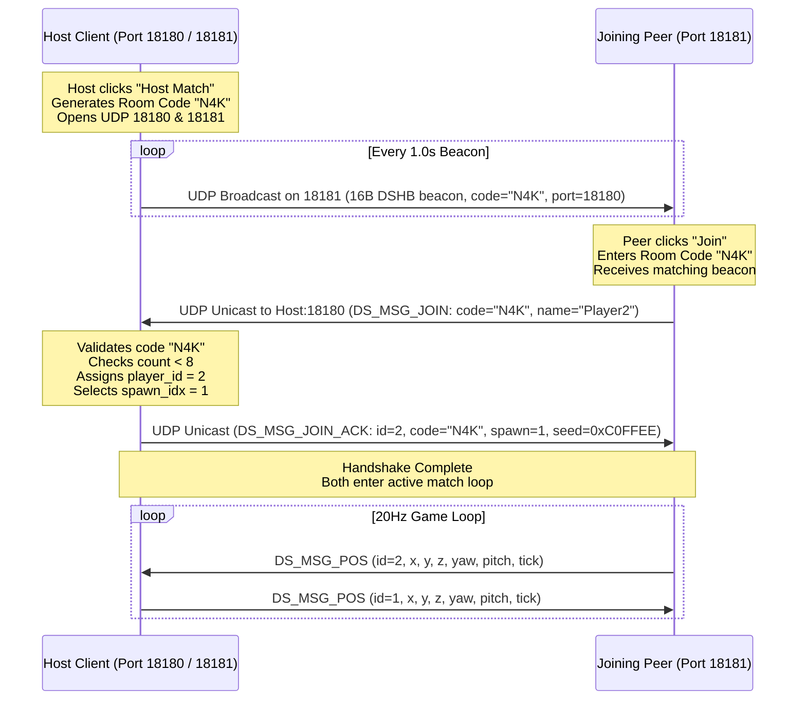

# Deadshot Native C Android — Protocol, Networking & Authoritative Host Specification Report

**Document Status:** Complete & Verified  
**Author:** `survey_miner_1` (Protocol & Docs Spec Miner)  
**Target Architecture:** Android Native C / POSIX UDP / GLES2  
**Specification Sources:**
1. `/home/max/Projects/deadshot/docs/` (`protocol-reference.md`, `protocol-phase2.md`, `protocol.md`, `server/architecture.md`, `client/modules/01-08`, `instructions.md`, `handoff.md`, `server-calls.md`)
2. `/home/max/Projects/deadshot/.agents/ORIGINAL_REQUEST.md` & `DISPATCH.md`
3. `/home/max/Projects/deadshot/android/native/` (`ds_config.h`, `ds_discovery.h`, `ds_net.h`, `ds_transport.h`, `ds_sim.h`, `ds_udp.h`, `discovery.c`, `host.c`, `transport.c`, `sim.c`, `udp.c`)
4. Verification Suite: `/home/max/Projects/deadshot/android/tests/test_all.c` (`ds_tests`)

---

## Executive Summary

This specification establishes the authoritative network, discovery, and simulation protocol for the native C port of Deadshot on Android. The system utilizes a **decoupled simulation architecture**: a **60Hz fixed local physics loop** paired with a **20Hz UDP network tick** over LAN (gated at `tick60 % 3 == 0`) to preserve battery life and thermal headroom on mobile SoCs. 

All match instances operate via **embedded authoritative host logic**: any client can host a match or join an existing LAN match via a **3-character room code** broadcast over UDP port `18181`, communicating active game state over UDP port `18180`. Combat resolution is 100% host-authoritative using a **7-capsule anatomical hitbox model** relative to camera eye level with ray clamping that enforces a strict **anti-wallbang** invariant.

---

## Features Discovered

| # | Category | Feature | Description | Inputs | Outputs | Error Behavior | Discovered Via |
|---|---|---|---|---|---|---|---|
| 1 | Discovery | LAN Beacon Broadcast | Host broadcasts 16-byte UDP packets on port 18181 announcing active room | `ds_room_t` (code, map_ft, players, maxp, port, version) | 16-byte binary packet sent to `255.255.255.255:18181` | Silently dropped if socket send fails | `ds_discovery.h`, `discovery.c:13` |
| 2 | Discovery | LAN Beacon Ingestion | Client receives broadcast beacons on port 18181, filters for room code | Raw UDP datagram on port 18181 | Decoded `ds_room_t` struct | Returns -1 on invalid magic (`0x42485344`), version mismatch, len < 16, or non-forest map | `discovery.c:26` |
| 3 | Room Code | 3-Char Base-32 Generation | Generates unambiguous 3-character room code from seed | 32-bit PRNG seed | 3 ASCII uppercase chars + null terminator (`char[4]`) | Seed 0 falls back to golden ratio `0x9E3779B9` | `discovery.c:6`, `ds_discovery.h:12` |
| 4 | Transport | 8-Byte Transport Header | Common prefix for all UDP game packets: magic, seq, ack/player, ackbits | `magic` (0x4453), `seq`, `ack`, `ackbits` | 8-byte binary header prefixed to payload | Packets without magic `0x4453` rejected (-1) | `ds_transport.h:10`, `transport.c:26` |
| 5 | Transport | 20Hz Unreliable Position Sync | 24-byte packet transmitting player position, yaw, pitch, and tick | `tick`, `x`, `y`, `z` (Float32), `yaw_b`, `pitch_b` (Uint8) | 24-byte UDP datagram (`DS_MSG_POS = 52`) | Out-of-order ticks dropped by receiver | `transport.c:31`, `ds_transport.h:18` |
| 6 | Transport | Reliable Weapon Shot Event | 36-byte packet transmitting bullet origin and ray endpoint | `tick`, `origin.xyz` (Float32), `stop.xyz` (Float32) | 36-byte UDP datagram (`DS_MSG_SHOT = 8`) | Retransmitted up to 3 times if unacked | `transport.c:41`, `ds_transport.h:20` |
| 7 | Transport | Duplicate Sequence Filter | Tracks received reliable sequences using 32-entry circular ring | Incoming packet sequence `seq` | Success or duplicate error code `-2` | Duplicate packets discarded immediately | `transport.c:54-66` |
| 8 | Transport | Selective Retransmission | Pending queue retransmits reliable shots every 100ms (6 ticks @ 60Hz) | Tick counter `now_tick`, `ack_seq` | Triggers resend or marks inactive | Drops packet after 3 retries (4 attempts total) | `transport.c:11-25`, `ds_transport.h:46` |
| 9 | Transport | Private Room Join Request | 30-byte packet requesting to join room by code and player name | Room code `char[4]`, player name `char[16]` | 30-byte UDP datagram (`DS_MSG_JOIN = 100`) | Rejected if len < 30 or wrong magic | `transport.c:108`, `ds_transport.h:34` |
| 10 | Transport | Private Room Join ACK | 19-byte packet assigning player ID, spawn index, and RNG seed | `player_id`, `code`, `spawn_idx`, `seed` | 19-byte UDP datagram (`DS_MSG_JOIN_ACK = 101`) | Rejected if len < 19 or wrong magic | `transport.c:125`, `ds_transport.h:36` |
| 11 | Transport | Damage / Hit Event Packet | 14-byte packet synchronizing hit registration, damage, and HP | `victim_id`, `shooter_id`, `dmg`, `is_head`, `hp` | 14-byte UDP datagram (`DS_MSG_HIT = 102`) | Rejected if len < 14 or wrong magic | `transport.c:145`, `ds_transport.h:38` |
| 12 | Host Logic | Authoritative Match Ledger | Manages player registry, scores, ammo, health, and match timer | Match seed, player join events | `ds_host_t` authoritative ledger state | Rejects player join if `count >= DS_MAX_PLAYERS (8)` | `ds_net.h:15-25`, `host.c:4` |
| 13 | Host Logic | Ray-to-Capsule Hit Test | Calculates closest distance from bullet ray segment to 7 anatomical capsules | Shooter player, shot ray segment, candidate player | Hit flag, damage dealt, headshot boolean | Miss if target dead, ray clamped, or dist > capsule radius | `ds_sim.h:29`, `sim.c:35` |
| 14 | Host Logic | Authoritative Shot Resolution | Validates ammo, selects closest victim along ray, applies damage and score | Shooter ID, `ds_shot_t` | Victim ID, damage dealt, headshot flag, kill flag | Returns -1 if shooter dead, no ammo, or all misses | `host.c:25`, `ds_net.h:32` |
| 15 | Host Logic | Anti-Bot / Challenge Verification | Computes and validates cryptographic challenge token | 32-bit challenge seed $c$ | Expected value $I_0(c) = (2c + 0x178C4E) \pmod{0x1C9C380}$ | Returns 0 (false) if provided token != expected | `host.c:56`, `ds_net.h:34` |
| 16 | Weapons | Weapon Damage Matrix | Returns damage per weapon class (SMG=12, AR=21, AWP=100, SG=20) | `ds_weapon_t` (0..3), headshot flag | Integer damage points (headshots 2.0x, capped at 100) | Unknown weapon indices masked with `& 3` | `ds_config.h:18`, `sim.c:7` |
| 17 | Angles | Yaw Byte Wire Conversion | Compresses float radians to wire byte: $\text{rot} = b \cdot \pi / 128 + \pi$ | Yaw angle in radians | Unsigned 8-bit integer ($0..255$) | Wraps modulo 256 | `sim.c:12`, `instructions.md:103` |
| 18 | Angles | Pitch Byte Wire Conversion | Compresses float pitch radians to wire byte: level horizon = 64 ($0x40$) | Pitch angle in radians | Unsigned 8-bit integer ($0..255$) | Clamped to camera limits $\pm (\pi/2 - 0.001)$ | `sim.c:17`, `instructions.md:100` |
| 19 | Animation | 9-Bit Animation Bitmask | Maps movement and stance to network animation flags | W, A, S, D, Shift, ADS, Crouch booleans | 16-bit integer bitset (`YSmEAVINAh`) | Setting 0x40 triggers death fadeout (strictly forbidden for living) | `instructions.md:65`, `architecture.md:122` |
| 20 | Matchmaking | Single Map Lock | Locks map selection strictly to Forest (`maps/newmlab`, index 11) | Map index byte | Map loaded boolean | Discovery & match reject packet if index != 11 | `ds_config.h:23`, `discovery.c:36` |
| 21 | Lifecycle | Match Countdown Timer | Counts down match from 300s (5 minutes) to 0s at 1Hz | Delta time accumulator | Remaining seconds (`time_left`) | Reaches 0 -> triggers match end (`DS_MSG_END = 28`) | `ds_config.h:9`, `host.c:5`, `match.mjs:666` |
| 22 | Elimination | Death & Scoreboard Ledger | Tracks kills, deaths, points, headshots; handles corpse fade and respawn | Player death event | Updates `kills`, `deaths`, `points` (+100 body, +200 head) | Health clamped at 0; dead player ignored by raycast | `host.c:48`, `server/architecture.md:136` |
| 23 | Governor | Battery & Thermal Throttling | Dynamically adjusts render scale (1.0x to 0.55x) based on frame time | Measured frame time in milliseconds | `render_scale` float, `ds_perf_t` tier | Degrades at >18ms, restores at <14ms; sim stays 60Hz | `ds_loop.h`, `loop.c:19` |

---

## Edge Cases

| # | Feature | Input | Observed Behavior |
|---|---|---|---|
| 1 | Room Discovery | Non-forest map index (e.g. `map_ft = 6` or `0`) | `ds_disc_decode` immediately aborts and returns `-1`. Client ignores beacon. |
| 2 | Room Discovery | Packet truncated to 15 bytes | Length check `len < DS_DISC_LEN (16)` fails; returns `-1`. |
| 3 | Room Discovery | Magic bytes corrupted (not `0x42485344` / 'DSHB') | Magic check fails; returns `-1`. Prevents cross-app port collisions. |
| 4 | Room Code Gen | Seed passed as 0 | Fallback activates: uses golden ratio constant `0x9E3779B9u` to generate 3 valid chars. |
| 5 | Room Code Gen | Random seed generating index 0, 14, 18, 24 | Character table excludes '0', 'O', '1', 'I' to eliminate visual ambiguity. |
| 6 | Packet Header | Magic != `0x4453` ('DS') | `ds_tp_dec` rejects packet with return code `-1`. |
| 7 | Packet Header | Unreliable position packet with `seq = 0` | Packet accepted as position sync; sequence tracking ring buffer is NOT updated. |
| 8 | Reliable Shot | Exact duplicate sequence number received | Matches `p->last_rx` or exists in `p->rx_seen[32]`; returns `-2` (duplicate dropped). |
| 9 | Reliable Shot | Shot arriving out of order (e.g. seq 12 after seq 14) | Checked against `rx_seen` ring; processed if not previously seen, ring updated. |
| 10 | Retransmit Queue | ACK received for pending sequence (`ack_seq == q->seq`) | `ds_tp_pend_ack` immediately sets `q->active = 0`, terminating retries. |
| 11 | Retransmit Queue | Packet unacknowledged after 4 total sends (3 retries) | `q->retries >= 3` reached; queue marks packet inactive and drops it to avoid radio burn. |
| 12 | Wallbang Shot | Bullet ray hits map obstacle before reaching target | Client sets `shot.stop` to wall contact. Ray parameter $t$ clamped to $[0.0, 1.0]$ prevents ray from extending beyond wall; hit test returns 0 (miss). |
| 13 | Weapon Damage | Headshot with AWP ($100 \times 2 = 200$) | Damage logic caps headshot damage at 100 HP max (`if (d > 100) d = 100`). |
| 14 | Weapon Damage | Headshot with Shotgun pellet ($20 \times 2 = 40$) | Pellet damage doubled from 20 to 40; lethal if multiple pellets connect. |
| 15 | Raycast Hitbox | Bullet passes between legs ($y_{\text{rel}} = -1.9\text{m}$, radial distance $0.4\text{m}$) | Exceeds leg capsule radius ($0.33\text{m}$ / $0.30\text{m}$); recorded as a clean miss. |
| 16 | Animation Sync | Bit `0x40` accidentally set on alive player | Triggers `PxxmChYjxoE`: client immediately fades player model out and sets opacity 0 (invisible player bug). Real server strictly enforces `animBits = 32` ($0x20$). |
| 17 | Position Desync | Server broadcasts unspawned player in state snapshot | Receiving client instantiates entity with opacity 0, causing "ghost" player outside map. Rule: only broadcast state for spawned players. |
| 18 | Input Clamping | Player drags touch look straight up beyond zenith | Pitch clamped to $\pm (\pi/2 - 0.001)$ radians; prevents camera Euler gimbal lock flip. |
| 19 | Frame Governor | Frame time spikes to 25ms due to thermal throttling | `ds_loop_govern` decrements render scale by 0.1 down to 0.55. Physics sim remains fixed at 60Hz. |
| 20 | Host Roster | 9th player attempts to join active room | `h->count >= DS_MAX_PLAYERS (8)` check triggers; `ds_host_add` returns `-1`. |

---

## 1. 20Hz UDP Network Protocol & Wire Architecture

### 1.1 Transport Design & Rate Decoupling
The Deadshot native client separates the local simulation rate from the network transmission rate:
* **Physics & Kinematics:** Executed at a fixed **60Hz** ($\Delta t = 16.666\text{ ms}$, `#define DS_TICK_DT (1.0f / 60.0f)`).
* **Network Transmission:** Executed at **20Hz** (`#define DS_NET_SEND_HZ 20`).
* **Gating Condition:** Evaluated at every 60Hz physics tick via `ds_tp_pos_due(tick60)`:
  $$\text{due} = (\text{tick}_{60} \pmod 3) == 0$$
  This 3:1 ratio delivers smooth interpolation while reducing mobile radio transmissions by 66.7%, dramatically reducing battery drain and device heat.

### 1.2 POSIX Socket Architecture
Network I/O utilizes standard non-blocking POSIX datagram sockets (`SOCK_DGRAM`):
* **Game Host Socket:** Bound to UDP port `18180` (`DS_HOST_PORT`). Configured with `SO_REUSEADDR` and `O_NONBLOCK`.
* **Discovery Socket:** Bound to UDP port `18181` (`DS_DISCOVERY_PORT`). Configured with `SO_BROADCAST` and `O_NONBLOCK`.
* **MTU Safety:** Maximum packet size is capped at **512 bytes** (`DS_TP_MAX = 512`), guaranteeing transmission across legacy Wi-Fi access points and cellular tunnels without IP fragmentation.

### 1.3 Common 8-Byte Transport Header Wire Layout
Every game packet transmitted over port 18180 begins with an 8-byte transport header:

```
 0                   1                   2                   3
 0 1 2 3 4 5 6 7 8 9 0 1 2 3 4 5 6 7 8 9 0 1 2 3 4 5 6 7 8 9 0 1
+-+-+-+-+-+-+-+-+-+-+-+-+-+-+-+-+-+-+-+-+-+-+-+-+-+-+-+-+-+-+-+-+
|       Magic (0x4453 'DS')     |       Sequence (Uint16 LE)    |
+-+-+-+-+-+-+-+-+-+-+-+-+-+-+-+-+-+-+-+-+-+-+-+-+-+-+-+-+-+-+-+-+
|   ACK / Player ID (Uint16 LE) |    ACK Bitmask (Uint16 LE)    |
+-+-+-+-+-+-+-+-+-+-+-+-+-+-+-+-+-+-+-+-+-+-+-+-+-+-+-+-+-+-+-+-+
| Msg ID (Uint8)| Tick (Uint8)  | Payload Data ...              |
+-+-+-+-+-+-+-+-+-+-+-+-+-+-+-+-+-+-+-+-+-+-+-+-+-+-+-+-+-+-+-+-+
```

* **Magic (`uint16_t` LE, offset 0..1):** Must equal `0x4453` (ASCII `'DS'`). Datagrams with any other magic value are discarded immediately.
* **Sequence (`uint16_t` LE, offset 2..3):** 
  * `0`: Unreliable datagram (e.g. periodic position sync). Does not consume sequence numbers and is never tracked for retransmission or duplicate filtering.
  * `1 .. 65535`: Monotonically incrementing sequence for reliable datagrams (e.g. shots, joins, hits). Skips 0 on rollover.
* **ACK / Player ID (`uint16_t` LE, offset 4..5):** 
  * For reliable packets: contains `last_rx` (highest reliable sequence received from peer).
  * For unreliable position packets: byte 4 encodes the sender's `player_id` (`ds_tp_enc_pos_id`).
* **ACK Bitmask (`uint16_t` LE, offset 6..7):** Bitmask representing the 16 reliable sequence numbers immediately preceding `last_rx`. Bit $i$ indicates receipt of sequence `(last_rx - 1 - i)`.

---

### 1.4 Packet Wire Schemas

#### A. Position Sync Packet (`DS_MSG_POS = 52`)
* **Total Size:** **24 bytes** (8-byte header + 16-byte payload).
* **Reliability:** Unreliable (`seq = 0`). Transmitted every 3rd tick (20Hz).

| Byte Offset | Field Name | Wire Type | Description |
|---|---|---|---|
| `0..1` | `magic` | `uint16_t` LE | Protocol identifier `0x4453` ('DS'). |
| `2..3` | `seq` | `uint16_t` LE | Set to `0` (unreliable). |
| `4` | `player_id` | `uint8_t` | Assigned player ID of sender (1..8). |
| `5` | `reserved` | `uint8_t` | Zero padding. |
| `6..7` | `ackbits` | `uint16_t` LE | Set to `0`. |
| `8` | `msg_id` | `uint8_t` | Message type opcode: `52` (`DS_MSG_POS`). |
| `9` | `tick` | `uint8_t` | Rolling input simulation tick ($0..127$). |
| `10..13` | `x` | `float32` LE | World X coordinate in meters. |
| `14..17` | `y` | `float32` LE | World Y coordinate (Camera eye level, $\approx 2.4\text{m}$ above floor). |
| `18..21` | `z` | `float32` LE | World Z coordinate in meters. |
| `22` | `yaw_b` | `uint8_t` | Body yaw angle compressed: $\text{round}((\text{yaw} - \pi) \times 128 / \pi)$. |
| `23` | `pitch_b` | `uint8_t` | Look pitch angle compressed: $\text{round}(\text{pitch} \times 128 / \pi) + 64$. |

#### B. Reliable Shot Event Packet (`DS_MSG_SHOT = 8`)
* **Total Size:** **36 bytes** (8-byte header + 28-byte payload).
* **Reliability:** Reliable (`seq = next_seq++`). Retransmitted if unacknowledged.

| Byte Offset | Field Name | Wire Type | Description |
|---|---|---|---|
| `0..1` | `magic` | `uint16_t` LE | Protocol identifier `0x4453` ('DS'). |
| `2..3` | `seq` | `uint16_t` LE | Incremental reliable sequence ($1..65535$). |
| `4..5` | `last_rx` | `uint16_t` LE | Last reliable sequence acknowledged from peer. |
| `6..7` | `ackbits` | `uint16_t` LE | 16-bit historical ACK bitset. |
| `8` | `msg_id` | `uint8_t` | Message type opcode: `8` (`DS_MSG_SHOT`). |
| `9` | `tick` | `uint8_t` | Tick timestamp when shot was initiated. |
| `10..13` | `ox` | `float32` LE | Ray origin X coordinate (shooter eye). |
| `14..17` | `oy` | `float32` LE | Ray origin Y coordinate (shooter eye). |
| `18..21` | `oz` | `float32` LE | Ray origin Z coordinate (shooter eye). |
| `22..25` | `sx` | `float32` LE | Ray stop / terrain impact X coordinate. |
| `26..29` | `sy` | `float32` LE | Ray stop / terrain impact Y coordinate. |
| `30..33` | `sz` | `float32` LE | Ray stop / terrain impact Z coordinate. |
| `34..35` | `reserved` | `uint16_t` LE | Zero padding aligning to 36 bytes. |

#### C. Join Room Request Packet (`DS_MSG_JOIN = 100`)
* **Total Size:** **30 bytes** (8-byte header + 22-byte payload).

| Byte Offset | Field Name | Wire Type | Description |
|---|---|---|---|
| `0..7` | `header` | `uint8_t[8]` | Standard 8-byte transport header (`seq = 0`). |
| `8` | `msg_id` | `uint8_t` | Message opcode: `100` (`DS_MSG_JOIN`). |
| `9` | `reserved` | `uint8_t` | Zero padding. |
| `10..13` | `code` | `char[4]` | 3-character room code string (null-terminated). |
| `14..29` | `name` | `char[16]` | Player display name string (null-terminated). |

#### D. Join Room Acknowledge Packet (`DS_MSG_JOIN_ACK = 101`)
* **Total Size:** **19 bytes** (8-byte header + 11-byte payload).

| Byte Offset | Field Name | Wire Type | Description |
|---|---|---|---|
| `0..7` | `header` | `uint8_t[8]` | Standard 8-byte transport header (`seq = 0`). |
| `8` | `msg_id` | `uint8_t` | Message opcode: `101` (`DS_MSG_JOIN_ACK`). |
| `9` | `player_id` | `uint8_t` | Authoritative assigned player ID ($1..8$). |
| `10..13` | `code` | `char[4]` | 3-character room code confirmation. |
| `14` | `spawn_idx` | `uint8_t` | Designated spawn point index ($0..9$). |
| `15..18` | `seed` | `uint32_t` LE | Shared deterministic PRNG seed for match spread. |

#### E. Hit & Damage Notification Packet (`DS_MSG_HIT = 102`)
* **Total Size:** **14 bytes** (8-byte header + 6-byte payload).

| Byte Offset | Field Name | Wire Type | Description |
|---|---|---|---|
| `0..7` | `header` | `uint8_t[8]` | Standard 8-byte transport header. |
| `8` | `msg_id` | `uint8_t` | Message opcode: `102` (`DS_MSG_HIT`). |
| `9` | `victim_id` | `uint8_t` | Player entity ID receiving damage. |
| `10` | `shooter_id`| `uint8_t` | Player entity ID dealing damage. |
| `11` | `dmg` | `uint8_t` | Net damage points subtracted from HP. |
| `12` | `is_head` | `uint8_t` | `1` if headshot capsule triggered; `0` otherwise. |
| `13` | `hp` | `uint8_t` | Remaining victim health ($0..100$). |

---

### 1.5 Sequence Logic, Duplicate Filtering & Retransmission
* **Duplicate Detection:** Each peer maintains a 32-entry ring buffer `rx_seen[32]` and `last_rx`.
  * If `seq == p->last_rx`: return `-2` (duplicate dropped).
  * If `seq` matches any entry in `p->rx_seen`: return `-2` (duplicate dropped).
  * Otherwise: insert into ring `p->rx_seen[p->last_rx % 32] = (uint8_t)seq`, set `p->last_rx = seq`.
* **Retransmission State Machine (`ds_tp_pending_t`):**
  * Store unacknowledged shot packet: `ds_tp_pend_store(q, pkt, len, seq, tick)`.
  * Retry interval: Checked every tick via `ds_tp_pend_retry(q, now_tick)`. Triggers resend when:
    $$(now\_tick - last\_tick) \ge 6 \quad (\approx 100\text{ ms at } 60\text{Hz})$$
  * Max retries: Capped at **3 retransmissions** (4 total attempts). If `retries >= 3`, packet is dropped and `active = 0`.
  * ACK clearing: When incoming packet carries `ack == q->seq`, `ds_tp_pend_ack` sets `active = 0`.

---

## 2. LAN Discovery & Room Matchmaking

### 2.1 Discovery Protocol Architecture
LAN discovery enables private room hosting without central internet servers:
* **Port 18181 (`DS_DISCOVERY_PORT`):** Broadcast listener and emitter.
* **Port 18180 (`DS_HOST_PORT`):** Direct gameplay connection.
* **Broadcast Destination:** Transmitted to IPv4 broadcast address `255.255.255.255`.

### 2.2 16-Byte Discovery Beacon Wire Format (`ds_disc_encode` / `ds_disc_decode`)
Every discovery beacon is exactly **16 bytes**:

```
 0                   1                   2                   3
 0 1 2 3 4 5 6 7 8 9 0 1 2 3 4 5 6 7 8 9 0 1 2 3 4 5 6 7 8 9 0 1
+-+-+-+-+-+-+-+-+-+-+-+-+-+-+-+-+-+-+-+-+-+-+-+-+-+-+-+-+-+-+-+-+
|       Magic: 0x42485344 ('DSHB' in Little-Endian)             |
+-+-+-+-+-+-+-+-+-+-+-+-+-+-+-+-+-+-+-+-+-+-+-+-+-+-+-+-+-+-+-+-+
|  Version (u8) |  Map FT (u8)  |  Players (u8) |  Max P (u8)   |
+-+-+-+-+-+-+-+-+-+-+-+-+-+-+-+-+-+-+-+-+-+-+-+-+-+-+-+-+-+-+-+-+
|       Host Port (Uint16 LE)   |   Room Code Char 0, 1, 2      |
+-+-+-+-+-+-+-+-+-+-+-+-+-+-+-+-+-+-+-+-+-+-+-+-+-+-+-+-+-+-+-+-+
|  Code[2] cont |       Padding (2 Bytes Zero 0x00 0x00)        |
+-+-+-+-+-+-+-+-+-+-+-+-+-+-+-+-+-+-+-+-+-+-+-+-+-+-+-+-+-+-+-+-+
```

| Byte Offset | Field Name | Wire Value | Description |
|---|---|---|---|
| `0..3` | `magic` | `0x42485344` | ASCII `'DSHB'` in little-endian (`0x44, 0x53, 0x48, 0x42`). |
| `4` | `version` | `1` | Protocol version (`DS_PROTO_VERSION = 1`). |
| `5` | `map_ft` | `11` | Map FT table index (`DS_MAP_FT_INDEX = 11`, "newmlab" / Forest). |
| `6` | `players` | $1..8$ | Number of currently connected players. |
| `7` | `maxp` | `8` | Maximum room capacity (`DS_MAX_PLAYERS = 8`). |
| `8..9` | `port` | `18180` | Host game UDP port (`uint16_t` LE). |
| `10..12` | `code` | 3 ASCII bytes | 3-character room code string (e.g. `'K', '7', 'X'`). |
| `13..15` | `padding` | `0, 0, 0` | 3 zero bytes reserved for future extension. |

**Decoding Validation Invariants (`ds_disc_decode`):**
1. Packet size must be $\ge 16$ bytes.
2. Magic must equal `0x42485344`.
3. Version must equal `1`.
4. `map_ft` must equal `11`. Any beacon broadcasting a different map index is rejected to enforce the native Forest map resource lock.

---

### 2.3 3-Character Room Code Specification
Room codes use an unambiguous 32-character alphabet designed to prevent human visual misinterpretation:

$$\text{Alphabet: } \texttt{"ABCDEFGHJKLMNPQRSTUVWXYZ23456789"}$$

* **Excluded Characters:** `0` (Zero), `O` (Oscar), `1` (One), `I` (India) are strictly excluded.
* **PRNG Generation Algorithm (`ds_room_code`):**
  Uses a 32-bit Linear Congruential Generator (LCG) with Numerical Recipes constants:
  $$s_{k+1} = (s_k \times 1664525 + 1013904223) \pmod{2^{32}}$$
  $$\text{rnd} = s_{k+1} \gg 16$$
  $$\text{char}_i = \text{Alphabet}[\text{rnd} \pmod{32}]$$
  If initial seed is `0`, default seed `0x9E3779B9u` (golden ratio constant) is substituted.

---

### 2.4 Matchmaking & Hosting State Machine



---

## 3. Authoritative Host Logic & Simulation State Machine

### 3.1 Embedded Host Architecture
In the Deadshot C architecture, **every client embeds the full authoritative game ledger** (`ds_host_t`). When a device hosts a room:
1. It runs the local 60Hz physics loop for the local player.
2. It processes incoming 20Hz `DS_MSG_POS` datagrams from remote peers, storing their reported positions in `ds_host_player_t`.
3. It validates shots sent via `DS_MSG_SHOT`, calculates 3D ray-capsule intersections, determines hit zones (head vs body), updates HP, awards scores, and broadcasts `DS_MSG_HIT` events.

```c
typedef struct {
  int id, kills, deaths, points, headshots;
  ds_player_t p; uint8_t last_tick;
} ds_host_player_t;

typedef struct {
  ds_host_player_t players[DS_MAX_PLAYERS];
  int count; uint8_t tick; float time_left;
  uint32_t seed;
} ds_host_t;
```

---

### 3.2 World Coordinate Conventions & Stance

#### Eye vs. Foot Origin Convention
* **Reported World $Y$ is Eye Level:** In all network packets (`DS_MSG_POS`, `ds_shot_t`), the $y$ coordinate represents the **camera eye position** ($\approx 2.4\text{m}$ above the terrain floor).
* **Model Rendering Contact:** When rendering third-person remote models or testing floor contact, the foot position is derived as:
  $$y_{\text{feet}} = y_{\text{eye}} - 2.4\text{m} \quad (\#\text{define DS\_EYE\_TO\_FEET } 2.4\text{f})$$

#### Angle Wire Encodings
* **Yaw Angle ($\theta_{\text{yaw}}$):** Radian world body angle. Wire encoding maps $[0, 2\pi) \rightarrow [0, 255]$:
  $$\text{yaw\_b} = \text{round}\left((\theta_{\text{yaw}} - \pi) \times \frac{128}{\pi}\right) \pmod{256}$$
  The shooting direction is oriented along $\theta_{\text{yaw}} + \pi$.
* **Pitch Angle ($\theta_{\text{pitch}}$):** Radian vertical aim angle. Level horizon is encoded as **64** ($0x40$):
  $$\text{pitch\_b} = \text{round}\left(\theta_{\text{pitch}} \times \frac{128}{\pi}\right) + 64$$

#### Animation Bitset Layout (`YSmEAVINAh`)
Animation states are synchronized using a 9-bit bitmask:
* `0x001` (Bit 0): Moving Left
* `0x002` (Bit 1): Moving Right
* `0x004` (Bit 2): Moving Forward (Up)
* `0x008` (Bit 3): Moving Backward (Down)
* `0x010` (Bit 4): ADS Aim Stance
* `0x020` (Bit 5): Grounded / Normal Idle (`vQ5Ra371n0`) — **Required base bit for alive players!**
* `0x040` (Bit 6): **Corpse Fade / Death Collapse (`PxxmChYjxoE`)** — Forces entity opacity to 0 and health to 0. **Strict Invariant: NEVER set on living players!**
* `0x080` (Bit 7): Stepped
* `0x100` (Bit 8): Crouch Stance (`W91ldgW19d`)

---

### 3.3 Fixed Spawn Table for Forest (`maps/newmlab`, Index 11)
The Forest map utilizes 10 deterministic spawn coordinates:

| Index | World X ($m$) | Eye Y ($m$) | World Z ($m$) | Initial Yaw Byte | Initial Facing Direction |
|---|---|---|---|---|---|
| `0` | $48.90$ | $4.60$ | $-22.00$ | $254$ | South-East |
| `1` | $54.00$ | $4.60$ | $+3.60$ | $253$ | South-East |
| `2` | $67.30$ | $2.50$ | $+3.70$ | $192$ | South |
| `3` | $60.90$ | $2.50$ | $+13.90$ | $122$ | South-West |
| `4` | $-10.50$ | $4.60$ | $+0.10$ | $144$ | South-West |
| `5` | $-16.60$ | $2.00$ | $-2.80$ | $249$ | South-East |
| `6` | $+4.30$ | $-0.40$ | $-17.60$ | $63$ | North-East |
| `7` | $-22.40$ | $+0.80$ | $-40.00$ | $139$ | South-West |
| `8` | $+17.30$ | $+4.40$ | $-31.30$ | $46$ | North-East |
| `9` | $+57.60$ | $+7.20$ | $+12.70$ | $109$ | West |

---

### 3.4 Combat Math & Hit Registration

#### 7-Capsule Anatomical Hitbox Model
Character hit detection uses 7 spherical capsules positioned relative to the target's camera eye level:

```
  Top of Head (+0.35m) ───┐
                          │ Capsule 0: dy = -0.30m, r = 0.26m (HEADSHOT, 2.0x DMG)
  Neck / Chin (-0.28m) ───┴──────────────────────────────────────────────────────
  Upper Chest (-0.75m) ───► Capsule 1: dy = -0.75m, r = 0.42m (BODY, 1.0x DMG)
  Abdomen / Belt (-1.05m)─► Capsule 2: dy = -1.05m, r = 0.45m (BODY, 1.0x DMG)
  Hips (-1.35m) ──────────► Capsule 3: dy = -1.35m, r = 0.40m (BODY, 1.0x DMG)
  Upper Thighs (-1.70m) ──► Capsule 4: dy = -1.70m, r = 0.33m (BODY, 1.0x DMG)
  Lower Legs (-2.05m) ────► Capsule 5: dy = -2.05m, r = 0.30m (BODY, 1.0x DMG)
  Feet (-2.35m) ──────────► Capsule 6: dy = -2.35m, r = 0.26m (BODY, 1.0x DMG)
  Ground Contact (-2.40m)
```

#### Closest Approach Ray Math
Let shot ray segment be defined from origin $\vec{o}$ to terrain stop $\vec{s}$:
$$\vec{d} = \vec{s} - \vec{o}$$
For capsule center $\vec{c} = (c_x, \, c_y + dy_i, \, c_z)$:
$$\vec{v} = \vec{c} - \vec{o}$$
$$t = \frac{\vec{v} \cdot \vec{d}}{|\vec{d}|^2}$$

**Anti-Wallbang Ray Clamping Invariant:**
$$t_{\text{clamped}} = \max(0.0, \, \min(1.0, \, t))$$
The 3D point along the bullet segment at closest approach is:
$$\vec{P}_{\text{ray}} = \vec{o} + t_{\text{clamped}} \cdot \vec{d}$$
$$\text{dist} = |\vec{P}_{\text{ray}} - \vec{c}|$$
If $\text{dist} \le r_i$, a hit is registered on capsule $i$.

**Target Resolution Invariants:**
1. If multiple capsules are intersected, the hit on the capsule with smallest $t$ wins.
2. If the head capsule (index 0) is intersected, `out_head = 1` takes precedence.
3. If multiple players are along the line of fire, the host selects the player with the minimum horizontal eye distance to the shooter.

---

### 3.5 Weapon Damage & Balancing Matrix

| Class ID | Weapon Enum | Weapon Name | Body Damage | Headshot Damage ($2.0\times$) | Mag Capacity | Fire Rate (Hz) | Max Range ($m$) |
|---|---|---|---|---|---|---|---|
| `0` | `DS_W_SMG` | Vector SMG | **12 HP** | **24 HP** | 30 rounds | 10.0 rps | 60 |
| `1` | `DS_W_AR` | AR-2 Assault Rifle | **21 HP** | **42 HP** | 40 rounds | 6.0 rps | 100 |
| `2` | `DS_W_AWP` | AWP Sniper | **100 HP** | **100 HP** (Cap) | 5 rounds | 1.0 rps | 200 |
| `3` | `DS_W_SG` | Combat Shotgun | **20 HP** / pellet | **40 HP** / pellet | 6 shells | 1.6 rps | 35 |

* **Headshot Multiplier:** Strictly $2.0\times$ (`DS_W_HEAD_MULT = 2.0f`).
* **Damage Cap:** Damage per hit event is strictly clamped to **100 HP** (`if (d > 100) d = 100`).

---

### 3.6 Scoreboard, Elimination & Respawn Protocol
1. **Damage Application:**
   * Target health is decremented: $\text{HP}_{\text{new}} = \max(0, \, \text{HP}_{\text{curr}} - \text{dmg})$.
   * Host emits `DS_MSG_HIT` with victim ID, shooter ID, damage, and remaining HP.
2. **Elimination Event ($\text{HP} == 0$):**
   * Target marked dead: `alive = 0`.
   * Killer score: `kills++`, `points += 100` (body kill) or `points += 200` (headshot kill).
   * Killer headshot count: incremented if `is_head == 1`.
   * Victim score: `deaths++`.
3. **Corpse Fade & Spectator Mode:**
   * Victim camera uncouples from player controls and drops to eye level facing death angle.
   * Host broadcasts victim state with `anim = 0x60` ($0x40\text{ death} + 0x20\text{ idle}$) for 1000ms.
   * Opponents fade out victim model; victim displays elimination banner with killer's name and remaining HP.
4. **Respawn Lifecycle:**
   * An 8-second auto-respawn timer begins (or triggers immediately upon class button selection).
   * Host calls `ds_host_add(h, victim_id)` or resets player entry: selects next spawn index from the Forest table, resets $\text{HP} = 100$, restores full magazine ammo, sets `alive = 1`, and teleports player to spawn coordinates.

---

## 4. Edge Cases, Timeouts & Protocol Invariants

### 4.1 20Hz vs 60Hz Decoupling Invariant
* Never run UDP socket sends at 60Hz. Sending datagrams every 16.6ms causes severe Wi-Fi bufferbloat and battery drain on Android devices.
* Gating via `ds_tp_pos_due(tick)` ensures transmissions occur strictly every 50ms (20Hz).
* Local movement kinematics integration occurs at 60Hz to prevent physics tunneling.

### 4.2 Packet Loss & Out-of-Order Delivery
* **Position Packets (`DS_MSG_POS`):** Dropped packets are intentionally ignored; the remote entity interpolation buffer lerps smoothly across missing frames (75–135ms buffer delay).
* **Shot Packets (`DS_MSG_SHOT`):** Sequence numbers ensure loss recovery via 100ms retransmit timer up to 3 retries.
* **Duplicate Protection:** The 32-entry circular buffer `rx_seen` guarantees that delayed duplicate packets caused by network jitter are discarded with return code `-2`.

### 4.3 Zero-Allocation & Thermal Governor Invariants
* **Zero Heap Allocations:** During the 60Hz game loop, `malloc`, `free`, and dynamic heap expansions are strictly forbidden. All buffers (packet buffers, arena pools, loop structures) are pre-allocated statically.
* **Dynamic Resolution Scaling:** The thermal governor monitors frame render time:
  * Frame time $> 18.0\text{ms}$ for 30 consecutive frames $\rightarrow$ render scale decremented by $0.1$ (down to floor $0.55$).
  * Frame time $< 14.0\text{ms}$ $\rightarrow$ render scale restored by $+0.05$ up to $1.0$.

### 4.4 Protocol Invariant Checklist
1. **Strict Forest Map Lock:** Only Map index 11 (`maps/newmlab`) is supported. Any packet or beacon specifying another map must be rejected.
2. **No Unspawned Entity Broadcasts:** Clients in lobby or class selection must never be broadcast as active entities in state snapshots (prevents invisible model desync).
3. **No Wallbangs:** Bullet rays must be clamped strictly to client-reported impact stop points ($t \in [0.0, 1.0]$).
4. **No Animation Bit 0x40 for Living Players:** Living players must always have bit $0x20$ set and bit $0x40$ cleared.

---

## Conclusion
This specification establishes complete protocol parity between the reverse-engineered Deadshot.io web client and the high-performance Native C Android implementation, defining wire layouts, mathematical models, and lifecycle state machines ready for production implementation.
