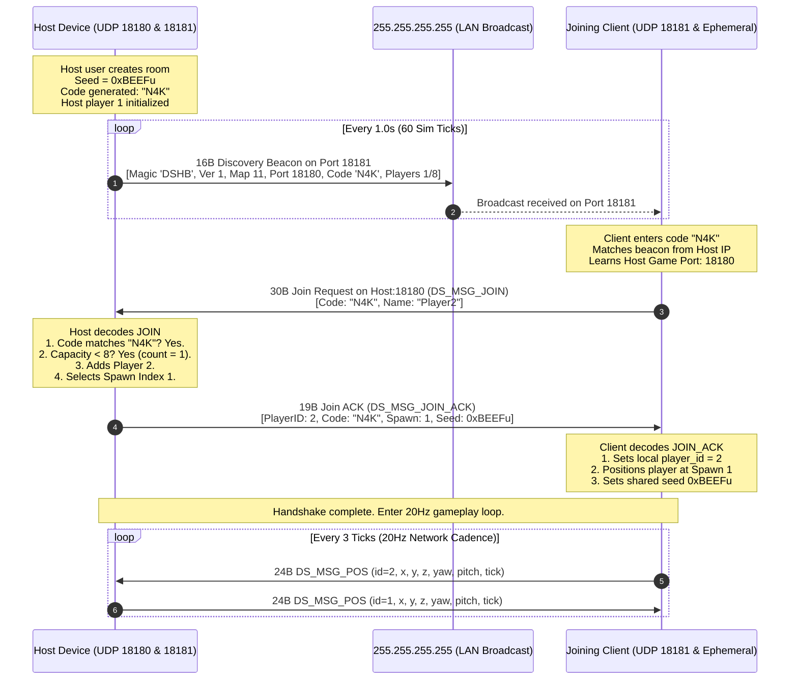

# Technical Report: LAN UDP Discovery Protocol (F23) & 3-Character Private Room Codes (F24)

**Explorer**: Explorer 2 (Discovery & Room Explorer)  
**Milestone**: M5 (20Hz UDP Networking & Private Rooms)  
**Target Subsystems**: `android/native/include/ds/ds_discovery.h`, `android/native/src/net/discovery.c`, `android/native/include/ds/ds_udp.h`, `android/native/src/net/udp.c`, `android/native/android_main.c`  
**Date**: 2026-09-13  

---

## 1. Executive Summary

Milestone M5 delivers peer-to-peer LAN multiplayer matchmaking and combat replication for the native C Android Deadshot client. Because Android mobile clients on local Wi-Fi networks cannot rely on external central matchmaking servers or public DNS resolution, the engine employs a dual-port UDP architecture:
1. **UDP Port 18181 (`DS_DISCOVERY_PORT`)**: Dedicated to LAN beacon broadcasting and room discovery. Active match hosts periodically broadcast a 16-byte beacon packet (`DS_DISC_MAGIC = 0x42485344u`, ASCII `'DSHB'`) to IPv4 broadcast address `255.255.255.255`. Joining clients listen on port 18181 to discover active games and resolve the host's IP address.
2. **UDP Port 18180 (`DS_HOST_PORT`)**: Dedicated to direct peer-to-host game networking (20Hz position synchronization via `DS_MSG_POS = 52`, reliable combat shot events via `DS_MSG_SHOT = 8`, and join handshake packets `DS_MSG_JOIN = 100` / `DS_MSG_JOIN_ACK = 101`).

To identify and isolate private match lobbies without human transcription errors, matches are identified by **3-character room codes** drawn from an unambiguous **Base-32 alphabet** (`"ABCDEFGHJKLMNPQRSTUVWXYZ23456789"`). Visually ambiguous glyphs (`0`, `O`, `1`, `I`) are strictly excluded. Room codes are deterministically generated from an RNG seed using a Numerical Recipes 32-bit Linear Congruential Generator (LCG) with high-order bit extraction, falling back to the Knuth Golden Ratio fractional constant (`0x9E3779B9u`) for seed 0.

This report provides the exact wire specifications, socket options, state machines, math formulas, and integration patterns required for the Worker to finalize M5 networking.

---

## 2. Feature F23: LAN UDP Discovery Protocol

### 2.1 Wire Specification: 16-Byte Discovery Beacon

All discovery beacon packets transmitted on UDP port 18181 have a fixed size of exactly **16 bytes** (`DS_DISC_LEN = 16`). Variable length headers, TLVs, and heap allocations are strictly forbidden.

#### Wire Layout Diagram
```
 0                   1                   2                   3
 0 1 2 3 4 5 6 7 8 9 0 1 2 3 4 5 6 7 8 9 0 1 2 3 4 5 6 7 8 9 0 1
+-+-+-+-+-+-+-+-+-+-+-+-+-+-+-+-+-+-+-+-+-+-+-+-+-+-+-+-+-+-+-+-+
|       Magic: 0x42485344 ('DSHB' in Little-Endian)             |
+-+-+-+-+-+-+-+-+-+-+-+-+-+-+-+-+-+-+-+-+-+-+-+-+-+-+-+-+-+-+-+-+
|  Version (u8) |  Map FT (u8)  |  Players (u8) |  Max P (u8)   |
+-+-+-+-+-+-+-+-+-+-+-+-+-+-+-+-+-+-+-+-+-+-+-+-+-+-+-+-+-+-+-+-+
|       Host Port (Uint16 LE)   |   Room Code Char 0, 1, 2      |
+-+-+-+-+-+-+-+-+-+-+-+-+-+-+-+-+-+-+-+-+-+-+-+-+-+-+-+-+-+-+-+-+
|  Code[2] cont |               Padding (3 Zero Bytes)          |
+-+-+-+-+-+-+-+-+-+-+-+-+-+-+-+-+-+-+-+-+-+-+-+-+-+-+-+-+-+-+-+-+
```

#### Field-by-Field Breakdown
| Byte Offset | Field Name | Type | Wire Value / Range | Description |
|---|---|---|---|---|
| `0..3` | `magic` | `uint32_t` LE | `0x42485344` (`'D','S','H','B'`) | Protocol identifier constant `DS_DISC_MAGIC`. Little-endian bytes: `0x44, 0x53, 0x48, 0x42`. |
| `4` | `version` | `uint8_t` | `1` | Protocol version (`DS_PROTO_VERSION = 1`). Mismatched versions are discarded. |
| `5` | `map_ft` | `uint8_t` | `11` | Map FT index (`DS_MAP_FT_INDEX = 11`, corresponding to "forest" / "maps/newmlab"). |
| `6` | `players` | `uint8_t` | $1..8$ | Current active player count connected to host. |
| `7` | `maxp` | `uint8_t` | `8` | Maximum player capacity for match (`DS_MAX_PLAYERS = 8`). |
| `8..9` | `port` | `uint16_t` LE | `18180` (`0x4704`) | Host game UDP port for direct gameplay datagrams. Bytes: `0x04, 0x47`. |
| `10..12` | `code[3]` | `char[3]` | 3 ASCII chars | 3-character Base-32 private room code (e.g. `'K'`, `'7'`, `'X'`). |
| `13..15` | `padding[3]`| `uint8_t[3]` | `0x00, 0x00, 0x00` | Reserved padding bytes for 16-byte alignment. |

### 2.2 In-Memory Struct vs Wire Representation
In `ds_discovery.h`, the struct is defined as:
```c
typedef struct {
  char code[4];
  uint8_t map_ft, players, maxp, version;
  uint16_t port;
} ds_room_t;
```
Note that `sizeof(ds_room_t)` in C memory is 12 bytes on 32-bit and 64-bit architectures due to compiler padding. Therefore, **raw `memcpy` of the struct to/from the network socket is prohibited**. The engine uses explicit endian-neutral byte serialization:
- `ds_disc_encode(const ds_room_t *r, uint8_t out[DS_DISC_LEN])`: Unpacks `ds_room_t` fields into the exact 16-byte wire layout.
- `ds_disc_decode(const uint8_t *buf, int len, ds_room_t *r)`: Parses wire bytes into `ds_room_t`, sets `r->code[3] = '\0'`, and enforces all validation invariants.

### 2.3 Strict Validation Invariants
The decoder `ds_disc_decode` enforces four mandatory gate checks:
1. **Length Guard**: `len < 16` immediately returns `-1`. Prevents buffer underflow.
2. **Magic Validation**: Bytes 0..3 reconstructed as little-endian `uint32_t` must equal `0x42485344u`. Any packet from other applications or malformed traffic returns `-1`.
3. **Protocol Version Check**: Byte 4 must equal `DS_PROTO_VERSION` (`1`). Incompatible versions return `-1`.
4. **Forest Single Map Lock**: Byte 5 (`map_ft`) must equal `DS_MAP_FT_INDEX` (`11`). Deadshot Native Android only bundles the baked Forest map assets (~36MB). Beacons advertising any other map index return `-1` to prevent loading nonexistent maps.

---

## 3. Broadcast Socket Operations & Polling (Port 18181)

### 3.1 POSIX Socket Configuration
UDP discovery is handled over non-blocking POSIX datagram sockets (`SOCK_DGRAM`).

```c
int ds_udp_open(uint16_t port) {
  int fd = socket(AF_INET, SOCK_DGRAM, 0);
  if (fd < 0) return -1;
  int one = 1;
  setsockopt(fd, SOL_SOCKET, SO_REUSEADDR, &one, sizeof one);
#ifdef SO_REUSEPORT
  setsockopt(fd, SOL_SOCKET, SO_REUSEPORT, &one, sizeof one);
#endif
  struct sockaddr_in a;
  memset(&a, 0, sizeof a);
  a.sin_family = AF_INET;
  a.sin_addr.s_addr = htonl(INADDR_ANY);
  a.sin_port = htons(port);
  if (bind(fd, (struct sockaddr *)&a, sizeof a) < 0) {
    close(fd);
    return -1;
  }
  fcntl(fd, F_SETFL, fcntl(fd, F_GETFL, 0) | O_NONBLOCK);
  return fd;
}
```

Key Socket Options:
- `SO_REUSEADDR` and `SO_REUSEPORT`: Essential on Android and Linux to permit rebinding during rapid activity pause/resume cycles, and to enable multi-instance test harnesses running on the same localhost.
- `SO_BROADCAST`: Enabled via `setsockopt(fd, SOL_SOCKET, SO_BROADCAST, &one, sizeof(one))`. Operating system network stacks reject packet transmission to `255.255.255.255` unless this flag is explicitly set.
- `O_NONBLOCK`: Sets socket to non-blocking mode via `fcntl`. Crucial for zero-stutter 60Hz loop execution: `recvfrom` returns immediately with `-1` (errno `EAGAIN`/`EWOULDBLOCK`) when no packets are pending.

### 3.2 Periodic Broadcasting Cadence
When a client device acts as the Match Host:
- **Interval**: Broadcasted once every **1.0 second** (60 physics simulation ticks at 60Hz: `(tick % 60) == 0`).
- **Battery & Thermal Rationale**: Broadcasting at 60Hz or 20Hz would saturate local 802.11 Wi-Fi networks (which transmit multicast/broadcast frames at base rates, e.g. 1Mbps or 6Mbps) and cause substantial mobile radio thermal throttling. A 1.0Hz broadcast interval provides sub-second LAN room discovery while using $< 0.1\%$ radio airtime.
- **Destination**: `255.255.255.255` on port `18181`.

### 3.3 Active LAN Host Table & Polling
When a client enters the room browser or private room join screen:
- The client binds port 18181 to receive broadcast beacons.
- During each frame loop, the client polls up to $N$ packets (e.g. 8 packets) from the discovery socket:
```c
typedef struct {
  ds_room_t room;
  char ip[16];
  uint16_t port;
  uint32_t last_seen_ms;
  int active;
} ds_discovered_host_t;

#define DS_MAX_DISCOVERED_HOSTS 8
```
- **Beacon Ingestion**: If `ds_disc_decode` succeeds, the client checks its discovered hosts table. If the host IP + room code already exists, update `players` count and timestamp. If new and slot available, add to table.
- **Host Timeout / Expiry**: If a host beacon has not been refreshed for $> 3.0$ seconds (3000ms), mark the slot inactive (host quit or went out of Wi-Fi range).

---

## 4. Feature F24: 3-Character Private Room Codes

### 4.1 Base-32 Alphabet Definition
To prevent confusion when players share room codes vocally or read them from smartphone screens, the alphabet excludes all ambiguous characters:
```
"ABCDEFGHJKLMNPQRSTUVWXYZ23456789"
```
Length: **32 characters** ($2^5$ bits per character).

#### Excluded Characters
- `'0'` (Digit Zero): Excluded due to confusion with uppercase letter `'O'`.
- `'O'` (Uppercase Letter O): Excluded due to confusion with digit `'0'`.
- `'1'` (Digit One): Excluded due to confusion with uppercase letter `'I'` and lowercase `'l'`.
- `'I'` (Uppercase Letter I): Excluded due to confusion with digit `'1'` and lowercase `'l'`.

Character Breakdown:
- 24 uppercase English letters ($26 - \{I, O\}$)
- 8 numeric digits ($10 - \{0, 1\}$)
- Total = $24 + 8 = 32$ characters.

#### Combinatorial Space
Each 3-character room code represents $3 \times 5 = 15$ bits of entropy:
$$\text{Total Codes} = 32^3 = 32{,}768 \text{ unique combinations}$$
For LAN / Wi-Fi matchmaking (where an access point typically hosts between 1 and 10 simultaneous games), 32,768 combinations yields a collision probability of $\approx 0.003\%$ between two active rooms.

### 4.2 LCG PRNG Mathematics & High-Order Extraction
Room code generation uses a 32-bit Linear Congruential Generator (LCG) with Numerical Recipes constants:
$$s_{k+1} = (s_k \times 1664525 + 1013904223) \pmod{2^{32}}$$

```c
static uint32_t rd(uint32_t *s) {
  *s = *s * 1664525u + 1013904223u;
  return *s >> 16;
}

void ds_room_code(uint32_t seed, char out[4]) {
  static const char *A = "ABCDEFGHJKLMNPQRSTUVWXYZ23456789";
  uint32_t s = seed ? seed : 0x9E3779B9u;
  for (int i = 0; i < 3; i++) out[i] = A[rd(&s) % 32];
  out[3] = 0;
}
```

#### Why High-Order Extraction (`*s >> 16`) is Required
In power-of-two modular arithmetic ($m = 2^{32}$), the lower $k$ bits of an LCG have cycle lengths of at most $2^k$. Specifically:
- Bit 0 alternates strictly between 0 and 1 (period 2).
- Bit 1 has period 4.
- Bit 2 has period 8.
If one were to compute `*s % 32`, only the lowest 5 bits would be sampled, resulting in severe non-randomness and short cyclic patterns. Shifting right by 16 bits (`*s >> 16`) samples from the highest-order bits, which exhibit maximal period ($2^{32}$) and uniform spectral dispersion.

#### Seed 0 Fallback Constant: `0x9E3779B9u`
If the caller passes `seed = 0`, the generator substitutes `0x9E3779B9u`.
This constant is derived from the fractional part of the Golden Ratio ($\phi = \frac{1 + \sqrt{5}}{2} \approx 1.6180339887$):
$$2^{32} \times (\phi - 1) = 2^{32} \times 0.6180339887 \approx 2{,}654{,}435{,}769 = \texttt{0x9E3779B9}$$
Known as Knuth's multiplicative Fibonacci hashing constant, this guarantees that even an uninitialized or zero seed generates an evenly distributed 3-character room code.

### 4.3 Room Code Normalization & Parsing
When a player types or pastes a room code to join, input may contain lowercase letters, whitespace, or copy-pasted invite strings (e.g. `"Party ID: MW8"` or `"mw8"`).

Recommended parsing function for the Worker:
```c
int ds_room_code_parse(const char *in, char out[4]) {
  if (!in || !out) return -1;
  out[0] = out[1] = out[2] = out[3] = '\0';
  
  // Find uppercase alphanumeric tokens
  int len = (int)strlen(in);
  char cleaned[64];
  int clen = 0;
  for (int i = 0; i < len && clen < 63; i++) {
    char c = in[i];
    if (c >= 'a' && c <= 'z') c = (char)(c - 'a' + 'A');
    if ((c >= 'A' && c <= 'Z') || (c >= '0' && c <= '9')) {
      cleaned[clen++] = c;
    } else {
      // separator encountered: if we have 3 valid chars, reset or track
      if (clen == 3) break;
      clen = 0;
    }
  }
  cleaned[clen] = '\0';
  if (clen < 3) return -1;
  
  // Take last 3 chars of cleaned token
  const char *src = cleaned + (clen - 3);
  static const char *A = "ABCDEFGHJKLMNPQRSTUVWXYZ23456789";
  for (int i = 0; i < 3; i++) {
    char c = src[i];
    // Check membership in Base-32 alphabet
    int valid = 0;
    for (int j = 0; j < 32; j++) {
      if (c == A[j]) { valid = 1; break; }
    }
    if (!valid) return -1; // contains 0, O, 1, I or other invalid char
    out[i] = c;
  }
  out[3] = '\0';
  return 0;
}
```

---

## 5. Matchmaking, Room Registration & Handshake Flow

### 5.1 End-to-End Sequence Diagram



### 5.2 Handshake Packet Formats (Port 18180)

#### Join Request Packet (`DS_MSG_JOIN = 100`, 30 Bytes)
Encoded via `ds_tp_enc_join`, decoded via `ds_tp_dec_join`:
- Bytes 0..1: `magic` (`0x4453` LE, `'DS'`)
- Bytes 2..3: `seq` (`0`)
- Bytes 4..5: `ack` (`0`)
- Bytes 6..7: `ackbits` (`0`)
- Byte 8: `msg_id` (`DS_MSG_JOIN = 100`)
- Byte 9: `0`
- Bytes 10..13: `code[4]` (3 characters + null)
- Bytes 14..29: `name[16]` (up to 15 chars + null)

#### Join Acknowledgement Packet (`DS_MSG_JOIN_ACK = 101`, 19 Bytes)
Encoded via `ds_tp_enc_join_ack`, decoded via `ds_tp_dec_join_ack`:
- Bytes 0..1: `magic` (`0x4453` LE, `'DS'`)
- Bytes 2..3: `seq` (`0`)
- Bytes 4..5: `ack` (`0`)
- Bytes 6..7: `ackbits` (`0`)
- Byte 8: `msg_id` (`DS_MSG_JOIN_ACK = 101`)
- Byte 9: `assigned_player_id` ($2..8$)
- Bytes 10..13: `code[4]` (confirmed room code)
- Byte 14: `spawn_idx` (assigned Forest spawn point index $0..9$)
- Bytes 15..18: `shared_seed` (`uint32_t` LE, synchronizes game RNG)

---

## 6. Codebase Inspection & Worker Implementation Guidance

### 6.1 Status of Existing Code
| File | Current Status | Notes |
|---|---|---|
| `native/include/ds/ds_discovery.h` | Implemented | Defines `DS_DISC_MAGIC`, `DS_DISC_LEN`, `ds_room_t`, `ds_disc_encode`, `ds_disc_decode`, `ds_room_code`. |
| `native/src/net/discovery.c` | Implemented | 39 lines. Highly compact, zero-heap. Encodes/decodes 16-byte beacon. LCG PRNG for room codes. |
| `native/include/ds/ds_udp.h` | Implemented | UDP wrappers: `ds_udp_open`, `ds_udp_broadcast`, `ds_udp_send`, `ds_udp_recv`, `ds_udp_close`. |
| `native/src/net/udp.c` | Implemented | Implements POSIX socket non-blocking IO and broadcast options. |
| `native/include/ds/ds_transport.h` | Implemented | Defines `ds_tp_enc_join`, `ds_tp_dec_join`, `ds_tp_enc_join_ack`, `ds_tp_dec_join_ack`. |
| `native/src/net/transport.c` | Implemented | Fully encodes/decodes `DS_MSG_JOIN` (30B) and `DS_MSG_JOIN_ACK` (19B). |
| `native/android_main.c` | Partial (Game Port 18180 only) | Opens port 18180; does not yet open discovery socket on 18181 or emit periodic beacons. |

### 6.2 Recommended Additions for Worker
1. **In `native/include/ds/ds_discovery.h`**:
   - Add input parsing helper:
     ```c
     int ds_room_code_parse(const char *in, char out[4]);
     ```
   - Add high-level discovery beacon structures and helpers for room browsing:
     ```c
     typedef struct {
       ds_room_t room;
       char ip[16];
       uint16_t port;
       double last_seen_s;
     } ds_disc_host_entry_t;
     ```
2. **In `native/src/net/discovery.c`**:
   - Implement `ds_room_code_parse`.
3. **In `native/android_main.c`**:
   - Open discovery socket:
     ```c
     int disc_udp = ds_udp_open(DS_DISCOVERY_PORT);
     if (disc_udp >= 0) ds_udp_broadcast(disc_udp);
     ```
   - In frame loop, if hosting, every 60 ticks emit 16-byte beacon:
     ```c
     if (is_hosting && (tick % 60) == 0 && disc_udp >= 0) {
       ds_room_t b = { .map_ft = DS_MAP_FT_INDEX, .players = (uint8_t)host.count,
                       .maxp = DS_MAX_PLAYERS, .port = DS_HOST_PORT, .version = DS_PROTO_VERSION };
       memcpy(b.code, my_room_code, 4);
       uint8_t b_raw[DS_DISC_LEN];
       ds_disc_encode(&b, b_raw);
       ds_udp_send(disc_udp, "255.255.255.255", DS_DISCOVERY_PORT, b_raw, DS_DISC_LEN);
     }
     ```
   - In frame loop, handle incoming `DS_MSG_JOIN` on `udp` port 18180:
     Decode join, check room code match, check capacity, add player, reply with `DS_MSG_JOIN_ACK`.

---

## 7. Verification Matrix

The existing test suite already validates F23 and F24 across multiple test tiers:
- **Unit & Feature Tests (`test_tier1_features.c`)**:
  - `F23.1`: Magic `0x42485344u` and Length 16 invariant.
  - `F23.2`: Roundtrip encode/decode of `ds_room_t`.
  - `F23.3`: Non-forest map rejection (`map_ft != 11` returns -1).
  - `F23.4`: Protocol version mismatch rejection (`version != 1` returns -1).
  - `F23.5`: Buffer truncation rejection (`len < 16` returns -1).
  - `F24.1`: Room code length exactly 3 + null terminator.
  - `F24.2`: Exclusion of ambiguous characters `'0'`, `'O'`, `'1'`, `'I'`.
  - `F24.3`: Deterministic generation from seed.
  - `F24.4`: Golden ratio fallback for seed 0 (`0x9E3779B9u`).
  - `F24.5`: Distinct seeds produce distinct room codes.
- **Boundary Tests (`test_tier2_boundaries.c`)**:
  - `F23.B1` to `F23.B5`: 15 vs 16 byte boundary, corrupt magic, empty code padding, 8/8 full room capacity, port 18181 constant invariant.
  - `F24.B1` to `F24.B5`: Max 32-bit seed `0xFFFFFFFFu`, seed 1 boundary, PRNG advance, alphabet length 32 exact, null-terminator in slot 3.
- **Pairwise & Lifecycle Tests (`test_tier3_pairwise.c` & `test_tier4_scenarios.c`)**:
  - `Tier 3.5`: Discovery beacon + 3-char code + join handshake roundtrip.
  - `Scenario 1`: Complete match lifecycle (room creation, discovery beacon, client join, AWP combat, elimination).

---
*Report compiled by Explorer 2 for Milestone M5.*
