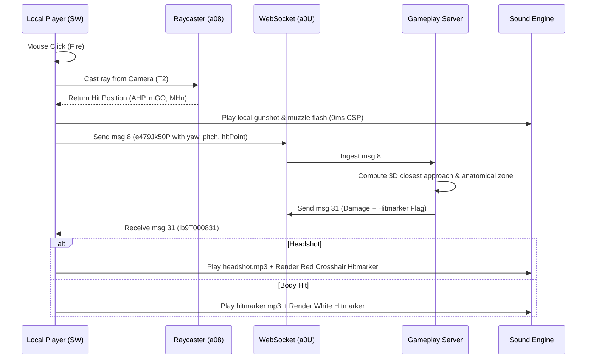

# Deadshot.io Client Internals & Subsystem Architecture

This document provides an in-depth reference for the reverse-engineered Deadshot.io client runtime (`raw/bundles/VM9.deob.txt`, 2.8 MB bundle).

---

## 1. Subsystems Overview

| Subsystem | Key Global / Function | Bundle Offset | Description |
|---|---|---|---|
| **Render Engine** | `Tm` (Scene), `T2`/`T4` (Cameras), `a34()` | 2061k, 2772k | Three.js r124 WebGL renderer, shadow maps, Draco/Basis KTX2 decoders |
| **Local Player** | `SW = new SV()` | 2512k | Local avatar state, camera attachment, movement simulation, input history |
| **Entity Manager** | `V3` (Opponent list), `a0t` (Weapon map) | 2664k | Multi-entity lifecycle, position interpolation queue (`5` snapshots), model caching |
| **Model & Rigging** | `Xw` (GLB cache), `XW()` (builder), `XU()` (swap) | 2577k | 3D mesh instancing, bone traversal, skin attachment, character rigs |
| **Animation Mixer** | `a3v = new AnimationMixer()` | 2577k | Bone animation blending (`Idle`, `Run`, `CrouchWalk`, `Death`, `AimAnimFP`) |
| **Weapon System** | `XN()` (weapon attach), `XM()` (clone), `Hs` | 2569k, 2075k | 1st-person & 3rd-person gun attachment, muzzle flash, recoil, audio bindings |
| **Raycast & Physics** | `QQ()` (physics), `a1U()` (shot fire), `a08` (`Raycaster`) | 2732k, 2772k | Voxel collision, slope sliding, bullet raycasting, hitmarker trigger |
| **Network & Codec** | `a11()` (dispatch), `Jg`/`Je` (codec), `a0I` (handlers) | 2084k, 2664k | Binary packet encode/decode, delta clocks, XOR encryption bridge |
| **UI & Menus** | `Kq` (Party/UI), `a35()` (Death banner), `L3` (Class buttons)| 2246k, 2498k | HTML5 DOM overlays, canvas scoreboard, HUD crosshair, killfeed |

---

## 2. 3D Scene Graph & Camera Hierarchy

```
WebGLRenderer
 ├── Tm (Main 3D World Scene)
 │    ├── Static Map Mesh (Draco out.drc + Lightmaps)
 │    ├── Local Player Mesh SW.r23ZS3L2g (Visible in 3rd-person / shadows)
 │    ├── Opponent Meshes V3[i].r23ZS3L2g (Bone hierarchy + Weapon attached)
 │    ├── Particle Systems (Tracer lines, Blood decals, Bullet impacts)
 │    └── Dynamic Lights & Shadow Casters
 ├── T3 / T5 / T6 (UI & Nametag 2D/3D Projection Scenes)
 │    └── 3D Floating Nametags & Health Bars
 └── Cameras:
      ├── T2: Main Perspective Camera (FOV: 90° standard, scaled by ADS / Sniper Scope)
      └── T4: First-Person Weapon Camera (FOV: 60°, prevents weapon clipping through walls)
```

---

## 3. Character Models & Skeletal Hierarchy

Deadshot models use standardized humanoid armature hierarchies:
- **Male Rig (`rigged_untextured.glb`):** Used for **Class 1 (AR)**.
- **Female Rig (`femalerigged.glb`):** Used for **Class 0 (SMG)**.
- **Tuxedo Rig (`tuxedonew.glb` / `tuxedoout.gltf`):** Used for **Class 2 (AWP)**.
- **Shotgun Rig (`shotgunplayerout.gltf`):** Used for **Class 3 (Shotgun)**.

### 3.1 Bone Node Structure & Anatomical Offsets
```
Root (0.00m)
 └── Hip (y = -1.20m to -1.30m relative to eye level)
      ├── Stomach (y = -0.80m)  [sFBgkXIVLn]
      │    └── Chest (y = -0.45m)
      │         └── TopChest / Neck (y = -0.28m)
      │              └── Head (y = +0.05m, top of skull +0.35m) [zcSmnYTnz]
      ├── ShoulderL -> ArmL -> HandL [tecVcpQaBj]
      └── ShoulderR [MatSlhWYen] -> ArmR [tovDoKGzj] -> HandR [oGUsalclTsY]
           └── Gun Bone [uMpvMUJct] (Weapon attachment anchor)
```

---

## 4. Animation Blending System

Each character instance allocates a Three.js `AnimationMixer` (`a3v`) managing clip actions:

| Action Identifier | Clip Name | Trigger / State | Blend Behavior |
|---|---|---|---|
| `idleAnim` | `Idle` | Player standing still | Base loop |
| `runAnim` | `Run` | Moving forward (`val & 0x01`) | Crossfade from Idle |
| `runSidewaysAnim` | `RunSideways2` | Strafing right (`val & 0x08`) | Additive lean |
| `runSidewaysLeft` | `RunSidewaysLeft` | Strafing left (`val & 0x04`) | Additive lean |
| `jumpAnim` | `Jump` | In air (`!(anim & 0x20)`) | One-shot upward extension |
| `crouchIdle` | `CrouchIdle` | Crouching still (`anim & 0x100`) | Lower hip offset hBc0.6\text{m}$ |
| `crouchWalk` | `CrouchWalk` | Crouching + moving | Scaled run animation |
| `aimAnimFP` | `AimAnimFP` | ADS / Right Click (`anim & 0x10`) | Arm alignment to camera center |
| `deathAnim` | `Death` | HP reaches 0 (`anim & 0x40`) | Ragdoll collapse + 000\text{ms}$ fade |

---

## 5. Weapon Attachment & Rendering (`XW`, `XN`, `XU`)

1. **Attachment (`XN`):**
   - Loads weapon GLTF binary (`weapons/ar2/ar2.glb`, `weapons/awp/awp.glb`, `weapons/vector/vector.glb`, `weapons/shotgun/shotgun.glb`).
   - Clones scene mesh via `XM(weaponType)`.
   - Attaches weapon root to player's right hand bone `oGUsalclTsY.add(weaponMesh)`.
   - Sets orientation offsets:  = -\pi/2, R_x = -\pi/10, R_y = -\pi/8$.
2. **Model Swapping (`XU`):**
   - When `msg 22` (`k1Qu903595`) is received for player ID:
     1. Removes old character model from Three.js scene: `Tm.remove(entity.r23ZS3L2g)`.
     2. Recycles old mesh into object pool: `XT(entity.r23ZS3L2g)`.
     3. Constructs new character mesh: `entity.r23ZS3L2g = XW(false, false, newWeaponType)`.
     4. Attaches corresponding weapon model via `XN`.

---

## 6. Combat, Raycasting & Hitmarker Pipeline



---

## 7. Interpolation & Desync Correction (`a11`, `Ko38`)

- **Snapshot Queue:** Opponent entities maintain a 5-slot snapshot buffer (`queue`).
- **Interpolation Delay:** Paced at 5\text{ms}$ to 35\text{ms}$ depending on client tick rate.
- **Clock Adjustment Messages:**
  - **`msg 4` (`Ko38N6873G6`):** Accelerates client sim clock by $+0.05 \times \text{step}$ to catch up.
  - **`msg 5` (`pi7M701p0`):** Decelerates client sim clock by hBc0.05 \times \text{step}$ on jitter burst.
  - **`msg 6` (`qv8j93zAL`):** Resets clock multiplier to base .0$.
