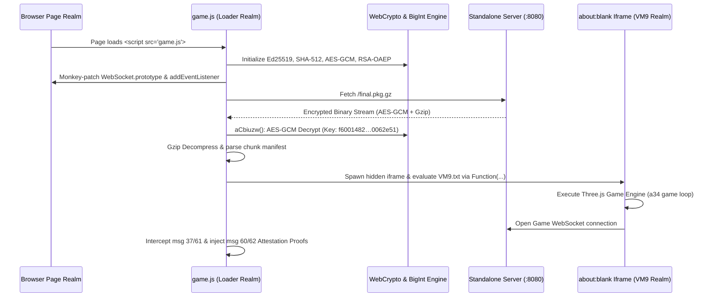

# Module 01: Bootstrap, Loader & Security Subsystem

This document provides an exhaustive, line-by-line technical assessment of the Deadshot.io client loader, cryptography engine, package decryption pipeline, sandboxing boundary, and anti-tamper mechanisms (`raw/bundles/game.deob.js`, 984,298 bytes, and `raw/bundles/VM9.deob.txt: 0k–200k`).

---

## 1. Loader Lifecycle & Execution Sequence

The client startup sequence is initiated by `game.js` (`raw/bundles/game.deob.js`):



---

## 2. Loader Cryptographic Suite & Concrete Byte Offsets

The loader embeds a self-contained cryptographic toolkit implemented in pure JavaScript using `BigInt` and `WebCrypto`:

| Cryptographic Primitive | Offset in `game.deob.js` | Implementation Details & Concrete Constants |
|---|---|---|
| **Ed25519 Curve Arithmetic** | `553,232 – 695,267` | Method-table IIFE `q7pZFi`. Field prime $p = 2^{255} - 19$ (`0x7ffff…ffffecn`), group order $\ell$ (`0x1000…14def9dea2f79cd65812631a5cf5d3edn`), base points $B_x$ (`0x216936d3cd6e53fec0a4e231fdd6dc5c692cc7609525a7b2c9562d608f25d51an`), $B_y = 4/5 \pmod p$ (`0x6666…6658n`), curve constant $d$ (`0x52036cee2b6ffe738cc740797779e89800700a4d4141d8ab75eb4dca135978a3n`), $\sqrt{-1} \pmod p$ (`0x2b8324804fc1df0b2b4d00993dfbd7a72f431806ad2fe478c4ee1b274a0ea0b0n`) at **554012–554382**. |
| **SHA-512 Digest** | `553,680` | `Try__f(z) = new Uint8Array(await subtle.digest("SHA-512", z))`. |
| **Hand-Rolled SHA-256** | `552,135 – 553,200` | Custom SHA-256 implementation with standard round K-constants `[0x428a2f98, … 0xc67178f2]` and base64url alphabet `"ABC…3456789-_"`. |
| **AES-GCM Decryption** | `549,721` | `aCbiuzw(zmjVzd_, AeaySZ)`: Uses `subtle.importKey("raw", key, "AES-GCM", false, ["decrypt"])` with IV (12 bytes) and ciphertext to decrypt `final.pkg`. |
| **RSA-OAEP-256** | `606,870` | Embedded 2048-bit server public key (modulus $n=256\text{ bytes}$, $e=65537$) used to encrypt tamper violation reports (`reportTamper()`). |
| **base64url Codec** | `676,675` | Custom RFC 4648 string transformer: `btoa(x).replace(/\+/g, '-').replace(/\//g, '_').replace(/=+$/g, '')`. |
| **KEaoJ45 PRNG Seeds** | `26,707` | Deterministic obfuscation seed `{ v: 2, h: "51153c87…", s: [26714 u32 words] }`. |

---

## 3. Package Decryption & Sandboxing Pipeline (`aCbiuzw`)

### 3.1 Package Fetcher & Decryption (`aCbiuzw` at `549721`)
```javascript
// Ground-truth structure in game.deob.js:
async function aCbiuzw(zmjVzd_, AeaySZ) {
  // zmjVzd_: Encrypted pkg payload (Uint8Array)
  // AeaySZ: Decryption Key (32 bytes raw)
  // Key: "f6001482da541c968b2c8352b525cf1ba56c256eb035ca22fa5b9fc3f0062e51"
  
  var iv = zmjVzd_.subarray(0, 12);           // 12-byte GCM IV
  var ciphertext = zmjVzd_.subarray(12);       // Ciphertext + 16-byte auth tag
  
  var cryptoKey = await crypto.subtle.importKey(
    "raw", AeaySZ, { name: "AES-GCM" }, false, ["decrypt"]
  );
  
  var decryptedBuffer = await crypto.subtle.decrypt(
    { name: "AES-GCM", iv: iv }, cryptoKey, ciphertext
  );
  
  // Gunzip decompress stream -> Plaintext JS bundle string
  return decompressGzip(decryptedBuffer);
}
```

### 3.2 Manifest Slicing & Iframe Sandbox Evaluation
* The decrypted plaintext contains chunk markers formatted as `@chunk:offset:length`.
* To prevent third-party DOM scripts and browser extensions from accessing internal game singletons, the loader spawns an invisible `about:blank` iframe:
  ```javascript
  var iframe = document.createElement('iframe');
  iframe.style.display = 'none';
  document.body.appendChild(iframe);
  var sandboxRealm = iframe.contentWindow;
  
  // Evaluate bundle in isolated execution context
  sandboxRealm.Function(bundleSource)();
  ```
* This isolates globals (`SW`, `V3`, `a0I`, `a0U`, `J3`) completely from the host window DOM.

---

## 4. WebSocket Traffic Interception & Attestation Engine

The loader installs monkey-patches on `WebSocket.prototype` at `661232–663800` to transparently inspect and inject attestation frames:

```mermaid
graph TD
    Game[VM9 Game Engine in Iframe] -->|ws.send(frame)| Hook[Loader WebSocket Proxy]
    Server[Remote Game Server] -->|onmessage(frame)| Hook
    Hook --> CheckMsg37{Is msg 37 Challenge?}
    CheckMsg37 -- Yes --> Inject60[Synthesize & Inject msg 60 Attestation Token]
    Hook --> CheckMsg61{Is msg 61 Constants?}
    CheckMsg61 -- Yes --> Build62[pZbp2K: Compute 32B HMAC Proof]
    Build62 --> Inject62[Inject msg 62 Frame over WebSocket]
    Hook --> PassThrough[Forward normal frames: msg 1, 2, 8, 22, 52]
```

### 4.1 `msg 61` Magic Constants Detector (`613342`)
The loader detects the server's per-session constants frame by checking magic words `m0` and `m1`:
```javascript
var dv = new DataView(frame);
if (dv.getUint16(0, false) === 0x003D           // msgId 61 (0x3D)
    && dv.getUint32(2, false) === 0x9e3779b9    // m0 (Nj3QYi)
    && dv.getUint32(6, false) === 0x7f4a7c15) { // m1 (oQn1ORk)
  // Detected msg 61 constants -> Trigger msg 62 proof builder
  handleMsg61(dv);
}
```

### 4.2 `msg 62` Proof Assembly (`pZbp2K` at `613482–614130`)
1. **Input Assembly (25 bytes):**
   * Byte `0`: `0x02` (Proof format version).
   * Bytes `1..8`: `Chy7gN` (8-byte fixed loader identity constant from `SM2pwJ(pHyTP9)`).
   * Bytes `9..24`: 16 raw bytes of `a‖b‖c‖d` extracted from offset `0x0A` of the `msg 61` frame.
2. **Cryptographic Proof Calculation:**
   $$\text{proof32B} = \text{SM2pwJ}("XraP2x", \, [\text{wufmly}, \, \text{input25B}])$$
3. **Transmission:**
   * Constructs 34-byte binary frame: `[0x003E][32 bytes proof]`.
   * Sends directly via `Reflect.apply(WebSocket.prototype.send, socket, [frame.buffer])`.

---

## 5. Anti-Tamper & Integrity Verifications

The loader runs continuous runtime integrity checks at `657191–657552`:

* **`runtime:WebSocket` Check:** Validates that `window.WebSocket` and `window.WebSocket.prototype` match native function signatures (`"function WebSocket() { [native code] }"`). If tampered:
  ```javascript
  irp6RD.reportTamper("runtime:WebSocket", violationDetails);
  ```
* **Prototype Integrity:** Inspects `Function.prototype.toString`, `Object.defineProperty`, and `ArrayBuffer` for tampering.
* **Stand-Alone Server Compatibility:**
  * In [`gameplay/server/src/gameplay-server.mjs`](file:///home/max/Projects/deadshot/gameplay/server/src/gameplay-server.mjs), [`subtle-shim.js`](file:///home/max/Projects/deadshot/gameplay/server/src/subtle-shim.js) satisfies `crypto.subtle` requirements under non-HTTPS `http://127.0.0.1:8080/`.
  * `patchBundle()` sets `Gq = true` (enables direct local WebSocket connection without external phone-home lookups).

---

## 6. Symbol Reference for Module 01

| Obfuscated Identifier | Scope / Offset | Human-Readable Name | Description |
|---|---|---|---|
| `aCbiuzw` | `game.deob.js: 549721` | `fetchAndDecryptPkg` | Asynchronous AES-GCM package decryption and gzip decompression function. |
| `SM2pwJ` | `game.deob.js: 553k` | `cryptoDispatcher` | Master cryptographic dispatcher for Ed25519 signatures, HMAC, and key generation. |
| `Chy7gN` | `game.deob.js: 613482` | `loaderProofConstant` | 8-byte fixed identity constant injected into `msg 62` proof input. |
| `Nj3QYi` | `game.deob.js: 661232` | `m0Constant` | `msg 61` magic constant `0x9e3779b9`. |
| `oQn1ORk` | `game.deob.js: 661232` | `m1Constant` | `msg 61` magic constant `0x7f4a7c15`. |
| `pZbp2K` | `game.deob.js: 613482` | `buildMsg62Proof` | Assembles 25-byte buffer and computes 32-byte Ed25519/HMAC signature for `msg 62`. |
| `_73nVdO` | `game.deob.js: 676675` | `base64urlEncoder` | RFC 4648 base64url string serialization utility. |
| `Try__f` | `game.deob.js: 553680` | `sha512Digest` | Wrapper executing `crypto.subtle.digest("SHA-512", ...)`. |
| `KEaoJ45` | `game.deob.js: 26707` | `prngSeedTable` | Deterministic runtime obfuscation seed state `{v: 2, h: "51153c87…", s: [...]}`. |
| `aHp` | `VM9.deob.txt: 0k` | `stringLookupTable` | 1,181-entry deobfuscated string literal array at the top of `VM9.txt`. |
