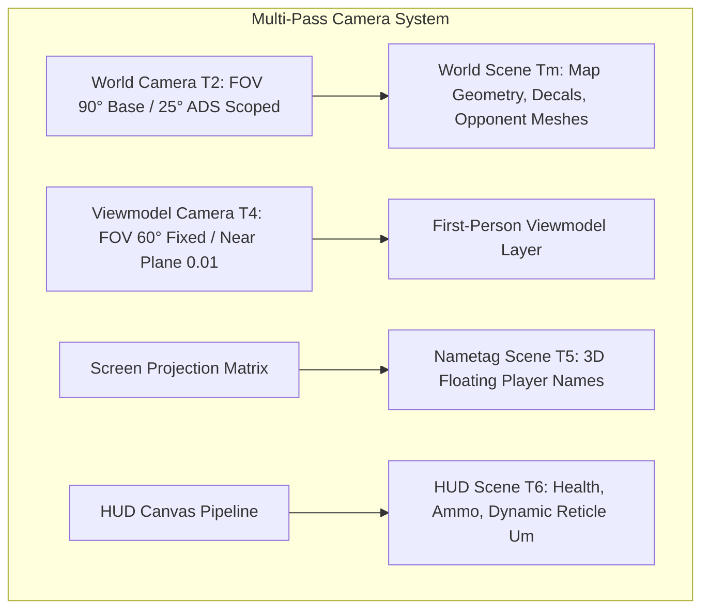
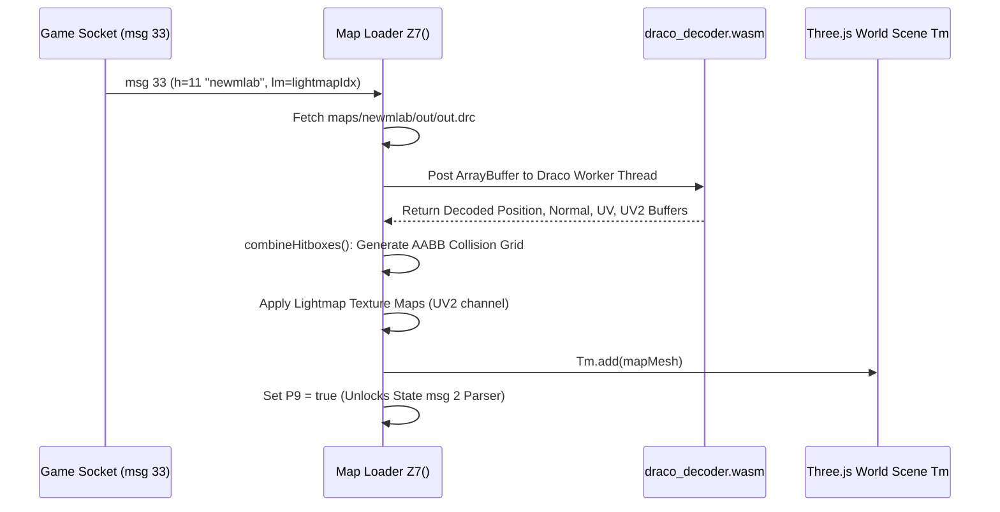

# Module 02: 3D Engine Primitives, Math & Rendering Subsystem

This document provides a deep technical analysis of the Three.js r124 WebGL renderer, mathematical foundations, scene graphs, Draco mesh decoders, Basis/KTX2 texture transcoders, and custom shader pipelines in the Deadshot.io client (`raw/bundles/VM9.deob.txt: 200k–1969k, 2512k–2598k`).

---

## 1. Engine Core & Three.js Namespace (`usvzFuAsEB`)

Inside `VM9.deob.txt`, the entire Three.js r124 library is bound to namespace object `usvzFuAsEB`:

| Obfuscated Key | Three.js Class / Symbol | Role |
|---|---|---|
| `usvzFuAsEB.QwysDsAqBdy` | `THREE.Scene` | Scene graph container for 3D and 2D display trees. |
| `usvzFuAsEB.jhtmwYcJfq` | `THREE.PerspectiveCamera` | Perspective projection camera with frustum culling. |
| `usvzFuAsEB.gURkzCzeY` | `THREE.Vector3` | 3D vector primitive $(x, y, z)$. |
| `usvzFuAsEB.kwrjVVjSgIH` | `THREE.BufferGeometry` | GPU-direct vertex buffer geometry. |
| `usvzFuAsEB.BasisTextureLoader` | `THREE.BasisTextureLoader` | Transcoder unpacking Basis Universal `.ktx2` textures. |
| `usvzFuAsEB.DRACOLoader` | `THREE.DRACOLoader` | WebAssembly worker bridge decompressing Draco `.drc` meshes. |

---

## 2. Camera Hierarchy & Projection Passes

### 2.1 World Camera (`T2` at `2512613`)
* **Constructor:** `new usvzFuAsEB.jhtmwYcJfq(T1, innerWidth/innerHeight, Gm, 3000)`
* **Base FOV ($T_1$):** $90^\circ$ standard ($85^\circ$ on mobile/gamepad).
* **ADS (Aim Down Sights) Scaling:**
  * SMG / AR: Smoothly interpolates to $70^\circ - 75^\circ$.
  * AWP Sniper Rifle: Drops to $25^\circ$ with black scope vignette (`SH`).
* **Clipping Planes:** Near plane $G_m = 0.1\text{ m}$, far plane $= 3000\text{ m}$.

### 2.2 Viewmodel Camera (`T4`)
* **Fixed FOV:** $60^\circ$.
* **Near Plane:** $0.01\text{ m}$.
* **Depth Buffer Isolation:** Rendered in a secondary pass with cleared depth buffer so first-person weapon models never clip into nearby map walls or player avatars.

---

## 3. 3D Scene Graph Architecture

| Scene Instance | Variable | Bundle Offset | Rendered Elements |
|---|---|---|---|
| **World 3D Scene** | `Tm` | `2515840` | Static map Draco geometry, terrain lightmaps, bullet tracers, impact decals, blood splatters, and opponent avatars (`V3[i].r23ZS3L2g`). |
| **Main Menu UI Scene** | `Mm` | `~2246k` | 2D/3D Lobby canvas elements, party slots (`a5B`/`a5C`), 3D weapon inspect viewmodels, and challenges panel (`Kq.eglp`). |
| **In-Match HUD Scene** | `Kq.nwxurZsxI` | `~2246k` | Real-time health bars, ammo counter, active mission tracker (`a6B`), and sliding completion toast (`a6D`). |
| **Floating Nametag Scene** | `T5` | `~2512k` | Projected 2D canvas text badges floating above opponent head bones. |

---

## 4. Geometry & Draco Decompression (`Z7` at `2597235`)

Maps are compressed as Draco glTF buffer geometries (`maps/<mapName>/out.drc`):

* **Map Load Gate (`P9`):** Inbound state messages (`msg 2`) check `if (!P9) return;` to prevent runtime crashes before map geometry finishes decoding.

---

## 5. Basis / KTX2 GPU Texture Transcoding (`1458k–1466k`)

The client embeds `BasisTextureLoader` to transcode `.ktx2` files into native GPU texture formats on WebAssembly worker threads:

| Detected Hardware / Platform | Transcoded GPU Format | Internal Constant |
|---|---|---|
| **Modern Desktop (DirectX / Vulkan)** | BC7 (BPTC) | `RGBA_BPTC_Format` (`cTFBC7_M5`) |
| **Legacy Desktop (S3TC DXT)** | DXT1 / DXT5 | `COMPRESSED_RGBA_S3TC_DXT5_EXT` (`cTFBC3`) |
| **Android / Mali / Adreno** | ETC1 / ETC2 | `RGB_ETC1_Format` (`cTFETC1`) |
| **iOS / Apple Silicon / Metal** | ASTC 4x4 / PVRTC | `RGBA_ASTC_4x4_Format` (`cTFASTC_4x4`) |

---

## 6. Shaders & Material Systems

1. **Static Lightmap Shader (`~980k`):**
   * Multiplies diffuse base texture with pre-baked illumination map:
     $$\vec{C}_{\text{final}} = \vec{C}_{\text{diffuse}} \times \vec{C}_{\text{lightmap}} \times \text{SunlightFactor}$$
2. **Bullet Tracer Shader (`~912k`):**
   * Procedural luminous cylinder with additive blending decaying linearly over 80ms.
3. **Corpse Fade Dissipation (`~2580k`):**
   * Triggered on death (`anim 0x60`), dissipating avatar alpha to 0 over 1000ms before `msg 7` despawns the mesh.
4. **AWP Sniper Scope (`SH` at `~2545k`):**
   * Post-processing vignette shader applying peripheral blur and reticle alignment.
