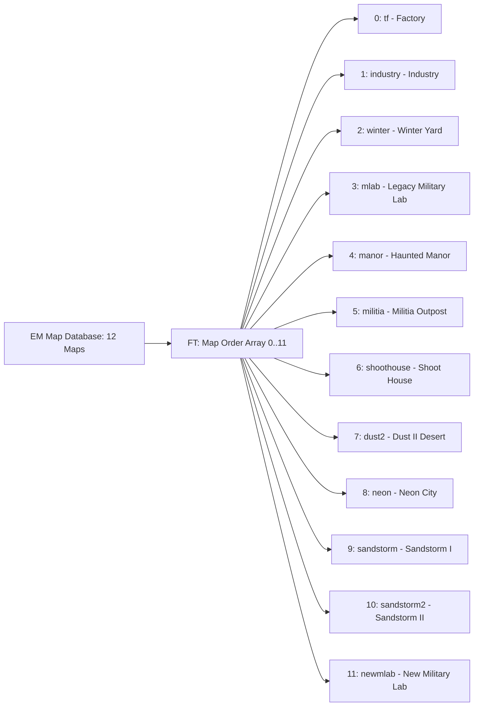

# Module 03: World Tables, Game Modes & Static Configurations

This document details the game world database, 12 map definitions, game modes, weapon statistics blocks, and core simulation constants in the Deadshot.io client (`raw/bundles/VM9.deob.txt: 1969k–2080k`).

---

## 1. World Map Database (`EM`, `FT`, `FO`)

The client maintains an internal registry of 12 playable maps stored in object `EM` (`offset 1,969,601`):



### 1.1 Complete Map Registry Table

| Index | Key | Display Name (`name`) | Draco Mesh File (`file`) | Draco Asset Folder (`folder`) | Unpacked Size (`size`) |
|---|---|---|---|---|---|
| `0` | `tf` | **Factory** | `out.drc` | `tf/out/` | $0.605\text{ MB}$ |
| `1` | `industry` | **Industry** | `out.drc` | `industry/out/` | $1.150\text{ MB}$ |
| `2` | `winter` | **Winter Yard** | `out.drc` | `winter/out/` | $0.850\text{ MB}$ |
| `3` | `mlab` | **Legacy Military Lab** | `out.drc` | `mlab/out/` | $1.420\text{ MB}$ |
| `4` | `manor` | **Haunted Manor** | `out.drc` | `manor/out/` | $2.100\text{ MB}$ |
| `5` | `militia` | **Militia Outpost** | `out.drc` | `militia/out/` | $1.650\text{ MB}$ |
| `6` | `shoothouse` | **Shoot House** | `out.drc` | `shoothouse/out/` | $0.980\text{ MB}$ |
| `7` | `dust2` | **Dust II** | `out.drc` | `dust2/out/` | $2.850\text{ MB}$ |
| `8` | `neon` | **Neon Cyberpunk** | `out.drc` | `neon/out/` | $3.300\text{ MB}$ |
| `9` | `sandstorm` | **Sandstorm I** | `out.drc` | `sandstorm/out/` | $1.890\text{ MB}$ |
| `10` | `sandstorm2` | **Sandstorm II** | `out.drc` | `sandstorm2/out/` | $2.240\text{ MB}$ |
| `11` | `newmlab` | **New MLab** (Default) | `out.drc` | `newmlab/out/` | $2.480\text{ MB}$ |

### 1.2 Map Schema & Properties (`EM[map]`)

* **`spawns`:** Array of fixed 3D spawn coordinates `[ {x, y, z, yaw}, … ]`.
* **`points`:** Capture hill center coordinates for `Point` / `Dom` modes.
* **`lightmaps`:** Pre-baked texture filenames mapped to UV channel 2.
* **`fineTuneSize`:** Scale multiplier for spatial partitioning grid.
* **`filter(material, x, y)`:** Per-material collision resolver modifying jump damping and footstep sound triggers (`audio/step0..3.mp3`).

---

## 2. Game Modes & Match Pools (`FL`, `FN`, `FP`, `FQ`, `FR`)

### 2.1 Game Mode Definitions (`FN`, `FL`)
Indexed by `msg 32` (`a0fN31N7p`) `h` field:

| Index | Key (`FN`) | Display Title (`FL`) | Objective Rules |
|---|---|---|---|
| `0` | `FFA` | **Free-For-All** | Solo deathmatch. First to reach score cap or highest kills at timer expiry wins. |
| `1` | `TDM` | **Team Deathmatch** | Red Team vs Blue Team. Total combined eliminations decide victory. |
| `2` | `SWAT` | **SWAT** | Tactical mode: Critical headshots deal instant lethal damage; body hits heavily mitigated. |
| `3` | `Point` | **Hardpoint** | Hill zone rotation. Players score ticks while holding the active point zone. |
| `4` | `Confirm` | **Kill Confirmed** | Eliminated players drop dog tags (`msg 35`). Team must retrieve tags to confirm points. |
| `5` | `Dom` | **Domination** | Three static flags (A, B, C) contested simultaneously for periodic score ticks. |

### 2.2 Match Configuration Pools
* **Match Durations (`FQ`):** `[5, 10, 20]` minutes (`0x5, 0xa, 0x14`).
* **Server Regions (`FR`):**
  * `'2'`: North America (US East / West)
  * `'9'`: Europe (Frankfurt / London)
  * `'52'`: Asia (Tokyo / Singapore)
  * `'40'`: South America (São Paulo)
  * `'35'`: Australia (Sydney)

---

## 3. Weapon Statistics & Damage Blocks (`Hs`, `Hx`, `Hy`)

Weapon definitions are initialized at `2,075,914` via stat blocks `Hb`, `Hg`, `Hl`, `Hq`:

```javascript
Hx = ['smg', 'ar', 'awp', 'shotgun']; // Weapon key array
Hy = ["Submachine Gun", "Assault Rifle", "Sniper Rifle", "Shotgun"];
```

### 3.1 Weapon Stat Comparison

| Stat Parameter | Internal Key | Class 0: SMG (`Hb`) | Class 1: AR (`Hg`) | Class 2: AWP (`Hl`) | Class 3: Shotgun (`Hq`) |
|---|---|---|---|---|---|
| **Model Rig (`Xw`)** | `xGnxhWRENA` | Female Rig (`0`) | Male Soldier (`1`) | Tuxedo Agent (`2`) | Heavy Trooper (`3`) |
| **Magazine Size** | `xqItLdaOH` | 30 rounds | 30 rounds | 5 rounds | 8 shells |
| **Base Damage** | `QuvgZimFkef` | 12 HP (Half-base) | 21 HP (Half-base) | 100 HP (Lethal) | $8 \times 15$ HP pellets |
| **Headshot Multiplier** | `lDK` | $2.0\times$ (24 HP) | $2.0\times$ (42 HP) | $2.0\times$ (200 HP) | $1.5\times$ (20 HP/pellet) |
| **Reload Duration** | `oCYaTYzkTP` | 45 ticks ($\approx 1.5\text{s}$) | 51 ticks ($\approx 1.7\text{s}$) | 75 ticks ($\approx 2.5\text{s}$) | 65 ticks ($\approx 2.2\text{s}$) |
| **Fire Delay** | `a1Y` | 3 ticks (10.0 rps) | 5 ticks (6.0 rps) | 30 ticks (1.0 rps) | 18 ticks (1.6 rps) |
| **Spread Bloom** | `bloomSpeed` | `0.3` (Medium) | `0.6` (Low) | `0.7` (Scoped 0) | `1.2` (Wide Cone) |
| **Single-Shot Bloom** | `shotBloom` | `0.005` | `0.020` | `0.000` (ADS) | `0.080` |
| **Recoil Kickback** | `cGKveZTJVJM` | `2.1` | `2.5` | `4.2` | `3.8` |
| **ADS Zoom FOV** | `T2.fov` | $75^\circ$ | $70^\circ$ | $25^\circ$ (Scoped) | $80^\circ$ |

---

## 4. Core Simulation Constants

Defined at offset `2,059,090`:

* **`G5 = 29.5`:** Fundamental simulation and network tick rate (ticks per second).
  * Tick interval: $\Delta t = \frac{1000}{29.5} \approx 33.898\text{ ms}$.
* **`G6 = 0.38`:** Movement friction and horizontal velocity damping coefficient per tick.
* **`G7 = 0.64`:** Gravity acceleration applied to vertical velocity $v_y$ every tick.
* **`Wr = 128 / Math.PI` ($\approx 40.74366$):** Angle scaling factor converting radians into single-byte integers ($0..255$).
* **`Ws = Math.PI / 128` ($\approx 0.02454$):** Reciprocal scale factor converting byte integers back to radians.
* **`WU = Math.PI / 2 - 0.001` ($\approx 1.56979$):** Vertical pitch clamping limit (prevents camera flip at zenith/nadir).
* **`Qz = 2 * Math.PI`:** Circle constant ($2\pi$).
