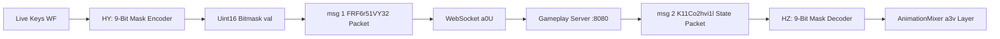

# Module 04: Network Codec, Wire Format & Handshake Protocol

This document details the binary message serialization engine, bitmask compression, inbound frame dispatch queue loop, 62-packet handler dictionary, and session handshake protocol in the Deadshot.io client (`raw/bundles/VM9.deob.txt: 2080k–2095k, 2664k–2715k`).

---

## 1. Input Bitset Compression (`HU`, `HY`, `HZ`, `H1` at `2080224`)

Movement keys and animation states are serialized into 9-bit Uint16 integers to maximize network throughput at 29.5Hz:



### 1.1 Bitmask Layout Table (`H1 = [1, 2, 4, 8, 16, 32, 64, 128, 256]`)

| Bit Offset | Mask Value | Key Property | Default Binding | Client Engine Behavior |
|---|---|---|---|---|
| `0` | `0x001` | `up` | `W` (Forward) | Increases forward velocity along camera yaw. |
| `1` | `0x002` | `down` | `S` (Backward) | Increases backward velocity along camera yaw. |
| `2` | `0x004` | `left` | `A` (Strafe Left) | Increases lateral velocity to local left. |
| `3` | `0x008` | `right` | `D` (Strafe Right) | Increases lateral velocity to local right. |
| `4` | `0x010` | `space` | `Spacebar` (Jump) | Triggers jump impulse $v_y = +0.28$ if grounded. |
| `5` | `0x020` | `HpsuHliFMHL` | `Shift` (Sprint) | Sprint multiplier ($1.25\times$). |
| `6` | `0x040` | `OUsPgMLOT` | `Right Mouse` (ADS) | Zooms camera FOV and activates aim stance. |
| `7` | `0x080` | `hRdQS9697` | `R` (Reload) | Initiates weapon reload cycle if ammo $< \text{max}$. |
| `8` | `0x100` | `MFUoomFzxq` | `C` (Crouch) | Lowers eye level and halves movement speed. |

---

## 2. Binary Serialization Codec (`J2`, `J3`, `Je`, `Jg`, `Jd`, `Jf`)

The engine uses a deterministic binary template codec with pre-allocated singleton objects (`offset 2,084,463`):

### 2.1 Field Types & Sizing Table (`I2`, `GI`)

| Type ID | Type Name (`GI`) | Byte Size (`I2`) | Memory Accessor |
|---|---|---|---|
| `0` | `Uint8` | 1 | `dv.getUint8(offset)` / `dv.setUint8(offset, val)` |
| `1` | `Int8` | 1 | `dv.getInt8(offset)` / `dv.setInt8(offset, val)` |
| `2` | `Uint16` | 2 | `dv.getUint16(offset, false)` (Big-Endian) |
| `3` | `Int16` | 2 | `dv.getInt16(offset, false)` (Big-Endian) |
| `4` | `Float32` | 4 | `dv.getFloat32(offset, false)` (Big-Endian) |
| `5` | `Uint32` | 4 | `dv.getUint32(offset, false)` (Big-Endian) |
| `6` | `Float64` | 8 | `dv.getFloat64(offset, false)` (Big-Endian) |

### 2.2 Wire Framing & String Codec (`Jd`, `Jf`)

```
┌─────────────────┬──────────────────┬─────────────────┬─────────────────┐
│ Msg ID (u16 BE) │ Fixed Fields...  │ Str Len (u16 LE)│ Chars (+0x80)   │
├─────────────────┼──────────────────┼─────────────────┼─────────────────┤
│ 2 bytes         │ Defined by schema│ 2 bytes         │ L bytes         │
└─────────────────┴──────────────────┴─────────────────┴─────────────────┘
```

* **String Serializer (`Jd`):** Writes string length as **Uint16 Little-Endian**, followed by each character byte shifted by `+0x80` ($\pmod{256}$).
* **String Deserializer (`Jf`):** Decodes characters via `(byte - 0x80) & 0xFF`.
* **Zero-Delimiter Frames:** Multiple messages in a single frame are packed back-to-back until offset reaches buffer end or encounters message ID `0x0000`.

---

## 3. Frame Dispatch Loop & Stream Decryption (`a11` at `2697939`)

```mermaid
graph TD
    WS[Inbound WebSocket ArrayBuffer] --> Q1[Push to Buffer Queue a0Z]
    Tick[a11 Main Tick Call] --> Swap[Swap Buffer Queues: a0Z <--> a10]
    Swap --> Decrypt[a0Y: (byte - a0G) XOR a0F]
    Decrypt --> Loop[DataView Offset Iteration]
    Loop --> Decode[Jg(): Read u16 MsgId & Extract Fields]
    Decode --> Handler[Invoke a0I[opcode](templateObj)]
    Handler --> Next[Advance Offset to Next Message]
```

### 3.1 Dual-Queue Swapping (`a0Z`, `a10`)
* To eliminate race conditions between incoming WebSocket asynchronous events and the synchronous render loop, the engine swaps queue pointers at the start of `a11()`:
  ```javascript
  let tempQueue = a0Z;
  a0Z = a10;
  a10 = tempQueue;
  ```

### 3.2 Stream Decryption Cipher (`a0Y` at `2697640`)
$$\text{plainByte} = ((\text{wireByte} - a_0G) \pmod{256}) \oplus a_0F$$
* In local standalone mode, keys $a_0F = 0$ and $a_0G = 0$, transforming the cipher into a high-speed identity pass.

---

## 4. Key Packet Handlers Reference (`a0I` at `2664142`)

The master handler table `a0I` contains routines for all inbound opcodes:

| Msg ID | Opcode Key | Wire Purpose | Client Action |
|---|---|---|---|
| **2** | `K11Co2hvi1l` | State Snapshot | Self (`id == a0T`): Verifies `a28[tick]` history for desync.<br>Opponent: Updates entity position, unpacks anim bitset via `HZ()`, and pushes to 5-slot lerp queue. |
| **3** | `v3j2TU68H` | Player Identity | Sets global local ID `a0T = val`. |
| **4 / 5** | `Ko38N6873G6` / `pi7M701p0` | Clock Sync | Adjusts opponent interpolation clock multiplier $W_g \pm 0.05$. |
| **7** | `N27s83WCNi` | Despawn Entity | Removes opponent avatar mesh `r23ZS3L2g` and nametag `T5` from world scene. |
| **8** | `e479Jk50P` | Fire Shot | Local raycast hit point $(AHP, mGO, MHn)$, angles, and sub-tick fraction sent to server. |
| **9** | `vS66uPxac49` | Terrain Impact | Spawns yellow spark particles, bullet-hole decal, and plays gunshot sound. |
| **10** | `a693b13D91R` | Blood Decal | Spawns 16 red particle spheres ejected along bullet vector. |
| **13** | `ZpZC792j9p3` | Hitmarker Audio | Plays `flesh.mp3` or `good_headshot.mp3` and pulses crosshair hit tick. |
| **18** | `UQbfX64829p` | Full Authoritative State | Overrides position/velocity on server teleport/respawn and sends `msg 16` ack. |
| **20** | `gB4Cncy3f4` | Player Death | Drops camera, unlocks pointer, and opens `a35()` respawn menu. |
| **22** | `k1Qu903595` | Class Weapon Swap | Calls `XU()` to swap character rig and parent new 3D weapon model. |
| **24** | `RMFVb5UZGi7` | Scoreboard Update | Updates ping (`p/2 ms`), K/D/A scores, and alive status. |
| **25** | `Y6805DB31Br` | Killfeed Banner | Appends streaming elimination card `[Killer] 🔫 [Victim]`. |
| **29** | `GDzF2709XA3` | Spawn Ready | Executes `Sq()`: Locks mouse pointer and enables live movement. |
| **31** | `ib9T000831` | Damage Direction Indicator | Renders red screen border arc pointing toward attacker angle. |
| **33** | `a22SWM3PvBo` | Map Asset Command | Triggers Draco map mesh loading sequence `Z7()`. |
| **36** | `N3OM6i9r83` | Handshake Complete | Stores cipher keys $a_0F / a_0G$, sets team ID, and unlocks spawn queue. |
