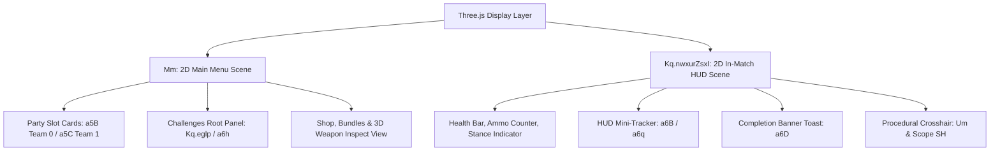
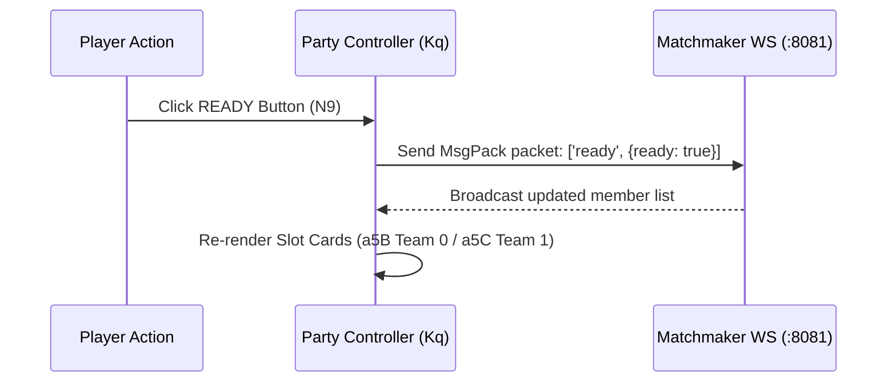
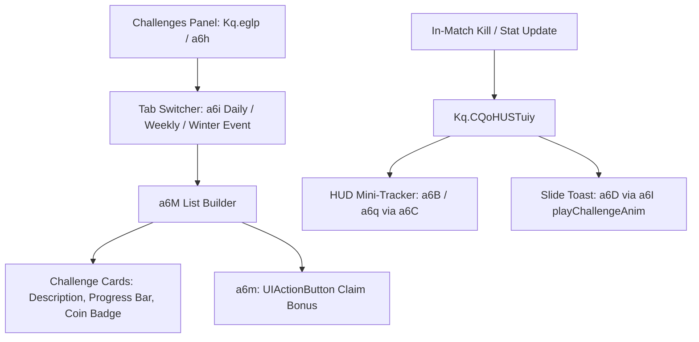

# Module 05: UI Framework & Menu Subsystems

This document details the internal 2D/3D canvas UI architecture, core widget classes (`a3D`, `a3J`), party lobby coordinator `Kq`, challenges subsystem, armory/shop modals, and death/pause menus in the Deadshot.io client (`raw/bundles/VM9.deob.txt: 2061k–2075k, 2138k–2465k`).

---

## 1. UI Framework Architecture & Scene Graphs

Deadshot.io renders its UI using custom canvas primitives integrated directly into Three.js orthographic display scenes:

---

## 2. Core Widget Components

### 2.1 `a3D` (Interactive Button Widget at `2,206,108`)
Standard clickable button widget used across lobbies, navigation tabs, and modal dialogs:
* **Constructor:** `new a3D(label, width = 360, height = 60, fontSize = 23.5)`
* **Internal Structure:**
  * Container element created via `a3m.element(a3m.makeContainer(0, 0, width, height))`.
  * Background panel `QtjDeukbWl` initialized with color `#BBB` and opacity `0.25`.
* **State Animations:**
  * Hover scale: smooth interpolation to $1.1\times$ scale over $0.075\times 7\text{s}$ (`Kq.buttonTime`).
  * Mouse down compression: scales to $0.94\times$ (`Kq.buttonDownSize`).
  * Border stroke opacity interpolates from $0.35$ to $1.0$.
* **Event Dispatch:** `buttonInstance.onclick = function() { ... }`.

### 2.2 `a3J` (Action & Claim Button at `2,213,764`)
High-visibility action button styled with gold/cyan gradients and secondary coin/reward badges:
* **Constructor:** `new a3J(label, width = 360, height = 60, fontSize = 23.5)`
* **Reward Attachment:**
  * Parents coin currency sprite `Lw` (`a3k.image`) to the right edge.
  * Dynamically sets reward numeric text: `a6p.setText('200')`.
* **Usage Sites:**
  * `READY` / `UNREADY` button in lobby (`N9`).
  * `Claim Bonus` on challenge completion (`a6m`).
  * `RESPAWN` on player elimination (`a35()`).
  * `Buy Gems` and `Unlock Spin` in the shop.

### 2.3 Canvas Display Primitives
* **`a3k.object`:** Transform node hierarchy managing children, positions, and opacity cascades.
* **`a3k.QtjDeukbWl(x, y, w, h, color, opacity)`:** Solid or semi-transparent rectangular panel.
* **`a3k.ycBClXLTJc`:** Ribbon / polygon geometry node used for category dividers and tab arrows.
* **`a3k.image(texture, x, y, w, h)`:** 2D textured sprite quad.
* **`Mj(font, text, x, y, size, align)`:** Procedural canvas text generator with bounding box calculation.

---

## 3. Subsystem Breakdown & Menus

### 3.1 Party & Matchmaking Lobby (`2,138,629 – 2,291,000`)
Managed by the global `Kq` controller object:

* **Party ID Field (`Kq.psUqMaJVeTK`):** Text display formatted as `"Party ID: <CODE>"`.
* **Member Slot Cards (`a5B` Team 0 / `a5C` Team 1):** Renders member rows, skin previews, and kick buttons for leaders.
* **Invite Slots (`a61 = new a3D('+')`):** Opens invite link popup (`Kq.OObFmbNOgbm()`).
* **Ready Button (`N9 = new a3J('READY')`):** Dispatches `ready`/`unready` MsgPack packets to matchmaker `:8081`.

---

### 3.2 Daily, Weekly & Event Challenges System (`2,261,227 – 2,271,000`)

* **Root Container (`Kq.eglp` / `a6h` at `2261227`):** Added to menu scene `Mm`, faded in/out during transitions.
* **Tab Switcher (`a6i = ['Daily', 'Weekly']`):** Switches active view between Daily (`L9`), Weekly (`La`), and Event (`Lb`) challenge data objects.
* **List Builder (`function a6M()` at `2267760`):** Instantiates cards with descriptions, fractional progress (`cur / max`), and checkmark badge `LA`.
* **Claim Bonus Button (`a6m = new a3J('Claim Bonus')`):** Submits `POST /claimDaily` or `POST /claimWeekly`.
* **Completion Toast (`a6D`, `a6F`, `a6G`):** Slide-in banner (`"Challenge Completed:"`) triggered mid-match by `a6I()` (`window.playAnim`).
* **HUD Mini-Tracker (`a6B`, `a6q`, `a6C`):** Compact progress widget embedded in the in-match HUD.

---

### 3.3 Shop, Armory & 3D Weapon Inspection (`~2320k–2420k`)
* **Lucky Spin Wheel:** Daily cosmetic roulette wheel (`Unlock Spin` action button).
* **3D Weapon Inspect Modal (`new a3D('Inspect')`):** Renders rotating 3D weapon model in an isolated camera pass.
* **Trade-Up Crafting (`new a3J('Trade Up')`):** Trades 5 lower-tier skins for 1 higher-tier skin.

---

### 3.4 In-Match HUD & Death Screen (`~2428k–2550k`)
* **Pause Menu (`ESC`):** Modal with `Resume Game`, `Settings`, and `Leave Match`.
* **Death Screen (`~2498k`, `function a35()`):** Releases mouse pointer lock, drops camera, displays killer stats, and class selector buttons `L3[0..3]`.
* **Game Over Podium (`~2218k`, `W4()`):** Displays `VICTORY` / `DEFEAT` banner, final scoreboard, and returns to lobby scene `Mm`.
