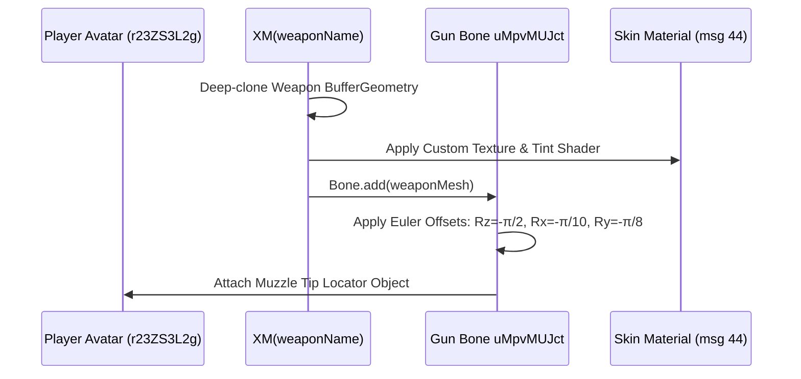
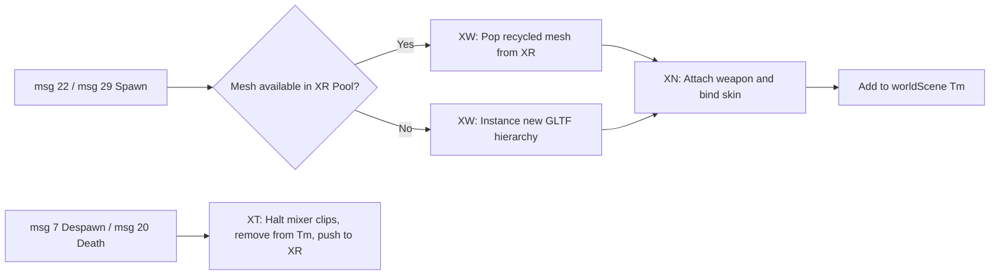

# Module 06: Character Models, Armatures, Rigging & Animation

This document details the 3D humanoid character armatures, skeletal node hierarchies, weapon attachment pipeline, zero-allocation mesh recycling pool, and animation blending engine in the Deadshot.io client (`raw/bundles/VM9.deob.txt: 2568k–2664k, 2780k–2782k`).

---

## 1. Character Armature Pool (`Xw` at `2568718`)

The client caches 4 humanoid armatures loaded from Draco glTF binaries (`character/compressed/`):

```mermaid
graph TD
    Xw[Xw Character Armature Cache] --> Rig0[Xw[0]: femalerigged.glb - Class 0 SMG]
    Xw --> Rig1[Xw[1]: rigged_untextured.glb - Class 1 AR]
    Xw --> Rig2[Xw[2]: tuxedonew.glb - Class 2 AWP Sniper]
    Xw --> Rig3[Xw[3]: shotgunplayerout.gltf - Class 3 Shotgun]
```

* **Class Association:** In Deadshot.io, player class (`0=SMG, 1=AR, 2=AWP, 3=Shotgun`) is permanently coupled with its respective rig:
  * Class 0 (SMG): Uses the agile female soldier armature.
  * Class 1 (AR): Uses the standard male infantry armature.
  * Class 2 (AWP): Uses the slender tuxedo operative armature.
  * Class 3 (Shotgun): Uses the heavy armored trooper armature.

---

## 2. Skeletal Node Hierarchy & Bone Mapping (`2578641`)

During model ingestion, the client traverses all glTF nodes of type `'Bone'` and binds them into internal dictionary `r23ZS3L2g`:

```javascript
// Exact bone mapper inside VM9.deob.txt:
if (node.type === "Bone") {
  if (match(node, "Stomach"))   mesh.sFBgkXIVLn = node;
  else if (match(node, "Armr")) mesh.tovDoKGzj  = node;
  else if (match(node, "Gun"))  mesh.uMpvMUJct  = node;
  else if (match(node, "Head")) mesh.zcSmnYTnz  = node;
  else if (match(node, "Shoulderr")) mesh.MatSlhWYen = node;
  else if (match(node, "Shoulderl")) mesh.DDmxHaBvzUS = node;
  else if (match(node, "Handr")) mesh.oGUsalclTsY = node;
  else if (match(node, "Handl")) mesh.tecVcpQaBj  = node;
}
```

### 2.1 Anatomical Bone Lookup Table

| Obfuscated Key | Bone Name | Anatomical Region | Height relative to Eye level | Role in Hit Detection |
|---|---|---|---|---|
| `zcSmnYTnz` | `Head` | Cranium / Face | $+0.05\text{ m}$ (Skull top $+0.35\text{ m}$) | Critical $2.0\times$ headshot hit cylinder. |
| `sFBgkXIVLn` | `Stomach` | Spine / Abdomen | $-0.80\text{ m}$ | Torso cylinder $(r=0.45\text{ m}, h=1.40\text{ m})$. |
| `MatSlhWYen` | `ShoulderR` | Right Shoulder | $-0.25\text{ m}$ | Rotates with head pitch to align aim stance. |
| `DDmxHaBvzUS` | `ShoulderL` | Left Shoulder | $-0.25\text{ m}$ | Rotates with head pitch to balance 2-handed grip. |
| `tovDoKGzj` | `ArmR` | Right Bicep / Forearm | $-0.35\text{ m}$ | Scaled along Z for recoil damping. |
| `oGUsalclTsY` | `HandR` | Right Hand Grip | $-0.55\text{ m}$ | Mounts third-person weapon viewmodel. |
| `tecVcpQaBj` | `HandL` | Left Hand Grip | $-0.55\text{ m}$ | Offhand support grip node. |
| `uMpvMUJct` | `Gun` | Weapon Anchor Bone | Mounted to `oGUsalclTsY` | Parent mount point for weapon model meshes. |

---

## 3. Dynamic Pitch-Linked Skeletal Kinematics (`2780941–2781952`)

When a player aims up or down, the engine calculates real-time skeletal procedural leaning:

1. **Head Pitch Clamping:**
   $$\theta_{\text{head}} = \text{clamp}(\text{pitch}, \, -\frac{\pi}{4}, \, +\frac{\pi}{4})$$
2. **Shoulder & Torso Offset Compensation:**
   * Both shoulders (`MatSlhWYen` and `DDmxHaBvzUS`) rotate proportionally to $\theta_{\text{head}}$.
   * Shoulder Z-depth shifts by $-\theta_{\text{head}} / 6$.
   * Shoulder Y-height adjusts by $-\theta_{\text{head}} / 20 + \text{Stomach.y} + 0.323$.
3. **Gun Alignment:**
   * The Gun bone (`uMpvMUJct`) and Right Hand (`oGUsalclTsY`) match the camera forward vector, ensuring weapon muzzles accurately project bullet raycast trajectories.

---

## 4. Weapon Attachment System (`XN`, `XM` at `2569k–2571k`)

Weapons are loaded from GLTF binaries in `gameplay/client/weapons/` (`vector.glb`, `ar2.glb`, `awp.glb`, `shotgun.glb`):



* **Muzzle Flash Tip (`tip` at `2571608`):** An empty transform node placed at $(0, 0.13, 0.75)$ on the weapon mesh from which bullet tracer lines and particle flashes originate.

---

## 5. Zero-Allocation Mesh Recycling (`XR`, `XT`, `XW`, `XU` at `2577k`)

To maintain a consistent 60+ FPS without garbage collection pauses during rapid player respawns:



* **`XR = []`:** Inactive mesh pool storing instantiated Three.js character scene hierarchies.
* **`XT(mesh)`:** Stops active animation mixer tracks, detaches mesh from `Tm`, and pushes to `XR`.
* **`XU(entity, newWeaponType)`:** Handles mid-match class changes (`msg 22` `k1Qu903595`):
  1. Recycles current rig: `XT(entity.r23ZS3L2g)`.
  2. Acquires new character rig for `newWeaponType`: `entity.r23ZS3L2g = XW(false, false, newWeaponType)`.
  3. Parents corresponding weapon model via `XN`.

---

## 6. Animation Blending Engine (`AnimationMixer`, `a3v`)

The Three.js `AnimationMixer` (`a3v`) blends humanoid skeletal animation clips driven by incoming `msg 2` animation bitsets (`YSmEAVINAh`):

| Action Name | Animation Clip | Trigger Bitmask / Event | Blending Dynamics |
|---|---|---|---|
| `idleAnim` | `Idle` | Player stationary (`anim == 0x20`) | Default looping base layer. |
| `runAnim` | `Run` | Forward motion (`val & 0x01`) | Crossfades over 150ms with stride pacing. |
| `runSidewaysAnim` | `RunSideways2` | Right strafe (`val & 0x08`) | Additive lean on spine/torso. |
| `runSidewaysLeft` | `RunSidewaysLeft` | Left strafe (`val & 0x04`) | Additive lean on spine/torso. |
| `jumpAnim` | `Jump` | Air state (`!(anim & 0x20)`) | Upward leg tuck and arm elevation. |
| `crouchIdle` | `CrouchIdle` | Crouched still (`anim & 0x10`) | Lowers root hip bone by $-0.60\text{ m}$. |
| `crouchWalk` | `CrouchWalk` | Crouched + moving | Stride cycle slowed to 60% playback rate. |
| `aimAnimFP` | `AimAnimFP` | ADS / Right Click (`anim & 0x40`) | Elevates right arm to bring weapon sights into camera center. |
| `deathAnim` | `Death` | HP reaches 0 (`anim & 0x60`) | Ragdoll collapse followed by 1000ms corpse fade. |
