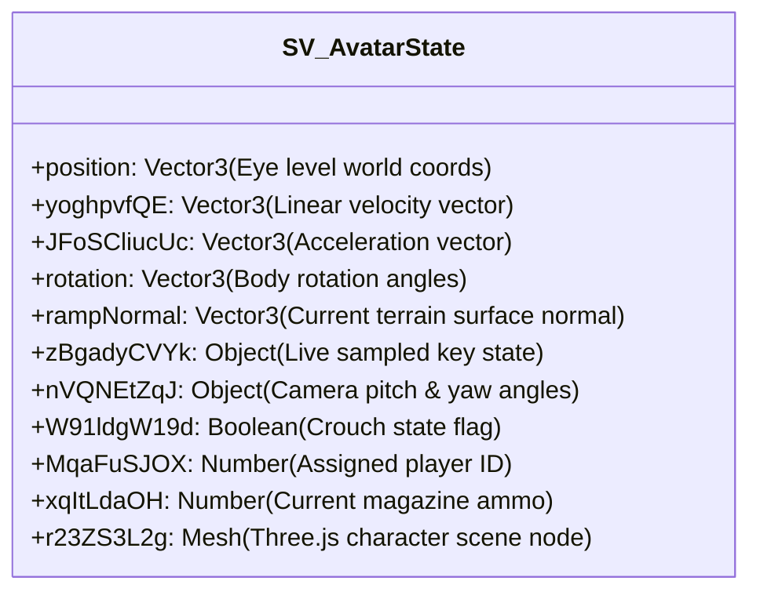

# Module 07: Player State, Input & Physics Simulation Loop

This document details the local player avatar singleton `SW`, 29.5Hz simulation game loop `a34()`, kinematics integration `QQ()`, input bitmask sampling, and opponent entity snapshot interpolation in the Deadshot.io client (`raw/bundles/VM9.deob.txt: 2511k–2568k, 2772k–2850k`).

---

## 1. Local Player Avatar State (`SW = new SV()` at `2512241`)

The singleton object `SW` represents the local player's simulation and camera state:



### 1.1 Eye Coordinate vs. Foot Origin Convention
* **Simulation Origin:** `SW.position.y` records the **camera eye level** above the terrain floor ($\approx +2.4\text{ m}$).
* When rendering 3rd-person models or computing footstep collision contacts, the mesh position is translated downward:
  $$\text{FootPosition} = (x, \, y - 2.4, \, z)$$

---

## 2. Main Simulation & Game Tick Loop (`a34` at `2772210`)

The main game tick is driven by `requestAnimationFrame` and locked to a **29.5Hz physics pacing**:

```mermaid
sequenceDiagram
    participant RAF as requestAnimationFrame
    participant Loop as a34() Tick Dispatcher
    participant Input as Live Input Sampler (WF, WY)
    participant Sim as Physics Integrator (QQ)
    participant Net as Game WebSocket (a0U)

    RAF->>Loop: Frame callback event
    Loop->>Loop: Delta time clamp: maxLag = 3000ms (0xbb8)
    Loop->>Loop: Calculate delta ticks: FJ = a33(dt)
    Loop->>Input: SW.zBgadyCVYk = WF (Keys), SW.nVQNEtZqJ = WY (Angles)
    Loop->>Loop: Angle normalization: mod 2π, pitch clamp to ±WU
    Loop->>Sim: QQ(FJ) -> Integrate kinematics & voxel collisions
    Loop->>Loop: a32() -> Advance opponent lerp queue
    Loop->>Loop: If alive (Gf): Tc(FJ) -> Recoil recovery
    Loop->>Net: If active: Send msg 1 (FRF6r51VY32) with tick a26 (0..127)
    Loop->>Loop: a28[a26].copy(SW.position) -> Store desync history
    Loop->>Loop: a26 = (a26 + 1) & 0x7F -> Wrap counter
```

### 2.1 Concrete `a34()` Implementation Breakdown

```javascript
function a34() {
  // 1. Delta time accumulation with 3000ms lag clamping
  GK = getTime() - a20;
  if (GK - a23 > 0xbb8) {
    GK = a23 + 0xbb8;
    a20 = getTime() - GK;
  }
  a22 = GK;
  var FJ = a33(GK - a23); // Delta simulation ticks

  // 2. Input sampling
  SW.zBgadyCVYk = WF; // Sample keyboard booleans
  SW.nVQNEtZqJ  = WY; // Sample pitch and yaw angles

  // 3. Angular normalization & pitch clamping
  while (WY[RY].y >= Qz) WY[RY].y -= Qz; // Wrap yaw [0..2π)
  while (WY[RY].y < 0)  WY[RY].y += Qz;
  X7 = Math.max(-WU, Math.min(WU, X7));  // Clamp pitch to ±(π/2 - 0.001)

  // 4. Physics and animation step
  QQ(FJ);                 // Kinematics and voxel map collision
  a32();                  // Opponent interpolation queue step
  if (Gf) Tc(FJ);         // Recoil recovery

  // 5. Build and transmit msg 1 frame over WebSocket
  if (a0J && a0U && Gf) {
    J3.FRF6r51VY32.val = HY(SW.zBgadyCVYk);                     // 9-bit bitmask
    J3.FRF6r51VY32.x   = Math.floor((yaw + WU) * Wr) % 256;     // Yaw byte
    J3.FRF6r51VY32.y   = Math.floor(pitch * Wr) % 256;          // Pitch byte
    J3.FRF6r51VY32.rBEdfQOuYkz = a26;                           // Input tick (0..127)

    Je(J3.FRF6r51VY32, sendBuf);
    a0U.send(sendBuf);

    // Record position history for server desync verification
    a27[a26] = J3.FRF6r51VY32.val;
    a28[a26].copy(SW.position);
    a26 = (a26 + 1) & 0x7F; // Wrap tick counter 0..127
  }
}
```

---

## 3. Physics Simulation & Voxel Collision (`QQ` at `2469980`)

The physics engine evaluates movement kinematics:

### 3.1 Kinematics Integration Math
* **Input Acceleration:** Derived from `val` directional bits (`W`, `A`, `S`, `D`):
  $$v_x = v_x + a_{\text{input}} \cdot \sin(\text{yaw}), \quad v_z = v_z + a_{\text{input}} \cdot \cos(\text{yaw})$$
* **Friction / Damping (`G6 = 0.38`):**
  $$\vec{v}_{\text{horizontal}} = \vec{v}_{\text{horizontal}} \times (1 - G_6 \cdot \Delta t)$$
* **Gravity Acceleration (`G7 = 0.64`):**
  $$v_y = v_y - G_7 \cdot \Delta t$$
* **Jump Impulse:** If grounded and `Spacebar` pressed, $v_y = +0.28$.
* **Slope Sliding:** When moving across angled ramps, velocity is projected along `SW.rampNormal`.

### 3.2 Voxel Map Collisions
* Queries spatial partitioning tree generated from Draco map hitboxes (`EM[map].hitboxes`).
* Uses axis-aligned bounding boxes (AABB) with sliding-plane resolution along map obstacles.

---

## 4. Opponent Entity Interpolation (`V3`, `a32`)

Opponent entities are tracked in array `V3` (`~2664k`):

```mermaid
graph LR
    Net[Inbound msg 2 Packet @ 40Hz] --> Push[Push Snapshot to Entity Queue]
    Push --> Buffer[5-Slot Interpolation Buffer]
    Buffer --> Lerp[a32(): Lerp Position & Angles (75-135ms Delay)]
    Lerp --> BoneUpdate[Update Skeletal Matrix & Hand Attachments]
    ClockSync[msg 4 / msg 5 Clock Sync] --> Lerp
```

* **Snapshot Queue:** Each entity maintains a **5-slot circular buffer** (`queue`).
* **Interpolation Delay:** Paced at $75\text{ms} - 135\text{ms}$ behind real time to smooth jitter.
* **Clock Sync Messages:**
  * **`msg 4` (`Ko38N6873G6`):** Accelerates client lerp clock: $W_g = W_g + 0.05 \times \text{val}$.
  * **`msg 5` (`pi7M701p0`):** Decelerates client lerp clock on network bursts.
  * **`msg 6` (`qv8j93zAL`):** Resets clock multiplier to $1.0$.
