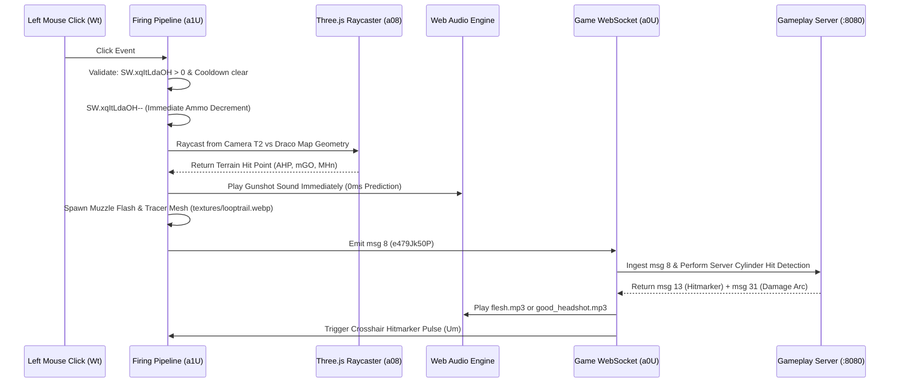

# Module 08: Combat, Raycasting, Projectiles & Audio/Visual FX

This document details the weapon firing pipeline, client-side bullet raycasting, dynamic recoil bloom, Web Audio spatial engine, and visual particle FX in the Deadshot.io client (`raw/bundles/VM9.deob.txt: 2150k–2245k, 2509k–2545k, 2732k–2771k`).

---

## 1. Weapon Firing & Shooting Pipeline (`a1U` at `2732861`)

When the local player presses the left mouse button (`Wt = true`):

### 1.1 Shot Packet Fields (`msg 8` / `e479Jk50P`)

| Field Key | Type | Description |
|---|---|---|
| `pMwSuGipfE` | `Float32` | Sub-tick interpolation fraction ($0.0 .. 1.0$) for sub-frame accuracy. |
| `VqpNEuOqqCX` | `Float32` | Timestamp / input tick counter when shot occurred. |
| `JoHdvmpcMvL` | `Float64` | Camera pitch angle in radians (including client vertical recoil offset). |
| `uBHZYKAHa` | `Float64` | Camera yaw angle in radians (shoot direction $= \text{yaw} + \pi$). |
| `AHPhtLFTi` | `Float32` | World raycast intersection **X coordinate** (terrain stop point). |
| `mGOwFesuTt` | `Float32` | World raycast intersection **Y coordinate** (terrain stop point). |
| `MHnEcbTxpbz` | `Float32` | World raycast intersection **Z coordinate** (terrain stop point). |

---

## 2. Dynamic Recoil, Spread Bloom & Scopes

### 2.1 Procedural Crosshair & Spread Bloom (`Um` at `2527484`)
* **Dynamic Spread Formula:**
  $$\text{SpreadRadius} = \text{BaseSpread} + \text{VelocitySpread} \cdot |\vec{v}| + \text{JumpSpread} \cdot (\text{inAir} ? 2.5 : 1.0)$$
* **Recoil Recovery:** Every animation frame, camera pitch recovers exponentially toward center via `Tc()` at rate $15\text{ s}^{-1}$.

### 2.2 AWP Sniper Scope Overlay (`SH` at `2509613`)
* **Scoped Mode Activation:** Right-click with Class 2 (AWP).
* **FOV Drop:** World camera `T2.fov` smoothly drops from $90^\circ$ to $25^\circ$.
* **Reticle Overlay:** Fullscreen DOM vignette shader with millimeter reticle crosshairs (`textures/flashes/flash04.webp`) and first-person weapon model hidden.

---

## 3. Web Audio Spatial Sound Engine (`~2150k`)

The audio engine utilizes the **Web Audio API** with spatial panning nodes for 3D sounds:

| Sound File | Path | Event Trigger |
|---|---|---|
| `famas.mp3` / `scar2.mp3` | [`audio/famas.mp3`](file:///home/max/Projects/deadshot/gameplay/client/audio/famas.mp3) | Assault Rifle gunshot. |
| `heavy sniper.mp3` | [`audio/heavy sniper.mp3`](file:///home/max/Projects/deadshot/gameplay/client/audio/heavy%20sniper.mp3) | AWP sniper high-caliber gunshot. |
| `shotgun.mp3` | [`audio/shotgun.mp3`](file:///home/max/Projects/deadshot/gameplay/client/audio/shotgun.mp3) | Shotgun blast. |
| `flesh.mp3` / `hitmark.mp3` | [`audio/flesh.mp3`](file:///home/max/Projects/deadshot/gameplay/client/audio/flesh.mp3) | Body hit confirmed (`msg 13`). |
| `good_headshot.mp3` | [`audio/good_headshot.mp3`](file:///home/max/Projects/deadshot/gameplay/client/audio/good_headshot.mp3) | Critical headshot hit confirmed (`msg 13`, `head = 1`). |
| `reload.mp3` | [`audio/reload.mp3`](file:///home/max/Projects/deadshot/gameplay/client/audio/reload.mp3) | Weapon magazine reload cycle. |
| `dryfire.mp3` | [`audio/dryfire.mp3`](file:///home/max/Projects/deadshot/gameplay/client/audio/dryfire.mp3) | Fire attempted with 0 ammo remaining. |
| `step0..3.mp3` | [`audio/step0.mp3`](file:///home/max/Projects/deadshot/gameplay/client/audio/step0.mp3) | Positional footstep sounds based on terrain material. |
| `death.mp3` | [`audio/death.mp3`](file:///home/max/Projects/deadshot/gameplay/client/audio/death.mp3) | Player elimination death sound. |

---

## 4. Visual Particle Systems & Combat Decals

### 4.1 Bullet Tracer Lines
* Generated from weapon muzzle tip locator node $(0, 0.13, 0.75)$ to raycast hit point $(AHP, mGO, MHn)$.
* Employs textured trail geometry (`textures/looptrail.webp`) fading linearly over 80ms.

### 4.2 Impact Sparks & Bullet-Hole Decals (`msg 9` / `vS66uPxac49`)
* Received when any bullet hits static map geometry.
* Spawns 12 directional yellow spark particles + bullet-hole decal quad (`textures/newhole.webp`) oriented by surface normal $(n_x, n_y, n_z)$.

### 4.3 Blood Splatters (`msg 10` / `a693b13D91R`)
* Received when a bullet hits an opponent avatar.
* Spawns 16 red spherical particle meshes ejected outward along bullet impact angle.

### 4.4 In-Game Combat Feedback Overlays
* **Directional Damage Indicator (`msg 31` / `ib9T000831`):** Renders red screen border arc pointing toward attacker angle if `arw = 1`.
* **Killfeed (`msg 25` / `Y6805DB31Br`):** Streaming notice: `[Killer] 🔫 [Victim]`.
* **Kill Streak Banner (`msg 23`):** Center-screen gold streak banner (`HEADSHOT`, `DOUBLE KILL`, `DOMINATING`).
