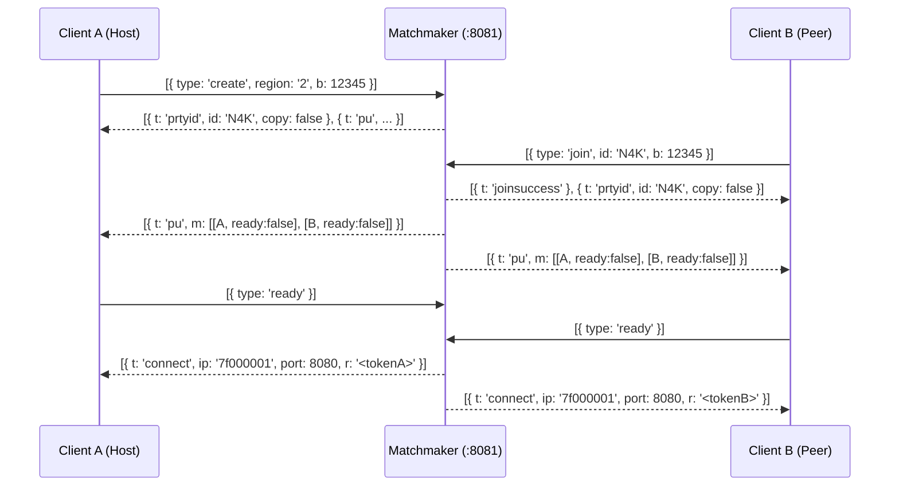

# Deadshot.io UI-to-Server Calls & Network Protocol Map

This document provides a comprehensive mapping connecting every **UI element, button, HUD action, and user interaction** in the Deadshot.io client to its **underlying server calls** (HTTP endpoints, Matchmaker WebSocket packets, and Game Socket binary messages).

---

## 1. Network Topology Overview

```
                          ┌───────────────────────────┐
                          │   Deadshot Client (UI)    │
                          └──────┬──────────┬─────────┘
                                 │          │
                     HTTP / REST │          │ Matchmaker WS (:8081)
                  (Static/Claims)│          │ (MessagePack Protocol)
                                 │          │
                                 ▼          ▼
                          ┌───────────────────────────┐
                          │    Matchmaking Server     │
                          │   (Rooms, Parties, Alloc) │
                          └─────────────┬─────────────┘
                                        │
                                        │ Token Handoff (`connect` pkt)
                                        ▼
                          ┌───────────────────────────┐
                          │      Gameplay Server      │
                          │    Game Socket (:8080)    │
                          │ (Custom 62-Template Codec)│
                          └───────────────────────────┘
```

---

## 2. Complete UI-to-Server Mapping Table

| UI Component | User Interaction / Event | Network Channel | Wire Packet / Message | Server Handler & Side Effects |
|---|---|---|---|---|
| **Daily / Weekly Challenges** | Click `"Claim Bonus"` (`a6m`) | HTTP POST | `POST /claimDaily`<br>`POST /claimWeekly`<br>`POST /claimEvent` | Grants user coin rewards in profile database and triggers `a8s()` refresh. |
| **Store / Shop** | Click `"Purchase"` / `"Claim Bundle"` | HTTP POST | `POST /claimSku`<br>`POST /claimReward` | Validates user balance, grants cosmetic skins, updates inventory. |
| **Telemetry / Crash Reporter** | Unhandled client exceptions | HTTP POST | `POST /stub/error` | Stubs client error logging in standalone mode. |
| **Lobby: Party Create** | Click `"Create"` button (`a3D`) | WS :8081 (MsgPack) | `type: 'create'`<br>`{ region, b }` | Generates 3-char room code, creates party room record, replies with `prtyid` packet. |
| **Lobby: Party Join** | Click `"Join"` button (`a3D`) | WS :8081 (MsgPack) | `type: 'join'`<br>`{ id, b }` | Validates room code, joins party, replies with `joinsuccess` and `prtyid`, broadcasts `pu`. |
| **Lobby: Ready Toggle** | Click `"READY"` / `"UNREADY"` (`N9`) | WS :8081 (MsgPack) | `type: 'ready'` / `'unready'` | Updates member status, broadcasts `pu`. When all ready, initiates `startGame(room)`. |
| **Lobby: Match Allocation** | All members ready | WS :8081 $\rightarrow$ Client | `t: 'connect'`<br>`{ ip, port, r: token }` | Client receives allocation token `r` and opens Game Socket at `ws://<ip>:8080/ws?r=<token>`. |
| **Lobby: Custom Info** | Change Name / Skins | WS :8081 (MsgPack) | `type: 'updatePlayerInfo'`<br>`{ name, skins }` | Broadcasts updated member list `pu` to all room occupants. |
| **Game Handshake: Step 1** | Client opens Game WebSocket | Game WS (:8080) | Server sends **`msg 37`** (`M35Oru2OB05`)<br>`{ val: u32 }` | Issues cryptographic/bot challenge seed to client. |
| **Game Handshake: Step 2** | Client solves challenge | Game WS (:8080) | Client sends **`msg 60`** + **`msg 30`** + **`msg 57`** | Enforces anti-bot response $I_0(\text{val}) = (2 \times \text{val} + 0x178C4E) \pmod{0x1C9C380}$. |
| **Game Handshake: Step 3** | Server generates session keys | Game WS (:8080) | Server sends **`msg 61`** (`Xar7p83ajar`) | Dispatches session parameters (`m0, m1, a, b, c, d`). |
| **Game Handshake: Step 4** | Proof verification | Game WS (:8080) | Client sends **`msg 62`** (`Ns010DV33`)<br>Server sends **`msg 36`** (`N3OM6i9r83`) | Verifies proof and sends `msg 36` (`auth accept`) with XOR keys `0, 0`. |
| **Match Initial Batch** | Auth accepted | Game WS (:8080) | Server sends Spawn Batch:<br>`msg 59, 3, 33, 32, 43, 44, 24, 22, 12, 56, 4` | Seeds map load (`msg 33`), self ID (`msg 3`), initial player names (`msg 43`), skins (`msg 44`), scoreboard (`msg 24`). |
| **Class Selection / Spawn** | Click class button (`L3[0..3]`) | Game WS (:8080) | Client sends **`msg 21`** (`B20L372s8`)<br>`{ v: 100, eXABYtRfN: weaponIdx }` | Server records selected weapon, replies with **`msg 22`** (weapon sync) + **`msg 18`** (full state snapshot). |
| **Spawn Activation** | Client confirms state | Game WS (:8080) | Client sends **`msg 16`** (`bWEt7LWg79Z`)<br>Server sends **`msg 17`** + **`msg 29`** | Sets camera facing (`msg 17`), unlocks mouse pointer lock and enables local simulation loop (`msg 29`). |
| **Player Movement** | Keyboard input / mouse look | Game WS (:8080) | Client sends **`msg 1`** (`FRF6r51VY32`) + **`msg 52`** (`BVaxA5RXAZ`) | Server ingests 9-bit key bitset, yaw/pitch bytes, and camera coordinates; relays to others as **`msg 2`** (~40Hz). |
| **Weapon Firing** | Left mouse click | Game WS (:8080) | Client sends **`msg 8`** (`e479Jk50P`)<br>`{ yaw, pitch, hitPoint }` | Server computes 3D ray closest approach, tests capsule hitboxes, applies damage, broadcasts FX (`msg 9, 10, 13, 31`). |
| **In-Game Chat** | Press `ENTER`, type message | Game WS (:8080) | Client sends **`msg 40`** (`kM86hVW024`)<br>`{ string }` | Server stamps sender player ID, verifies text length, and broadcasts **`msg 40`** to all players. |
| **Scoreboard Display** | Hold `TAB` key | Game WS (:8080) | Server emits **`msg 24`** (`RMFVb5UZGi7`) at 10Hz | Updates scoreboard table: ping (`round(p/2)ms`), kills, deaths, points, alive status. |
| **Match Clock & Timer** | HUD header countdown | Game WS (:8080) | Server emits **`msg 19`** (`ld52k5uY7`) at 1Hz | Updates match time in `mm:ss` format. |
| **Player Death / Respawn** | HP reduced to 0 | Game WS (:8080) | Server sends **`msg 20`** (victim) + **`msg 25`** (killfeed) + **`msg 23`** (streak banner) | Drops victim camera, releases pointer lock, broadcasts corpse fade (`anim 0x60`), despawns via **`msg 7`**, auto-respawns in 4s. |
| **Match End** | Timer reaches 0:00 | Game WS (:8080) | Server sends **`msg 28`** (`D522Kq7l5n`) | Triggers Game Over podium screen (`W4()`), shows victory/defeat banner. |
| **Leave Match** | Click `"Leave Match"` in pause menu | Game WS (:8080) | Client closes WebSocket connection | Server removes player from world and broadcasts **`msg 7`** (`despawn`) to all active players. |

---

## 3. Detailed Protocol Specifications

---

### 3.1 HTTP / REST Endpoints

Handled by the HTTP listener in [`gameplay/server/src/gameplay-server.mjs`](file:///home/max/Projects/deadshot/gameplay/server/src/gameplay-server.mjs):

```http
POST /claimDaily
Content-Type: application/json
{ "idtoken": "<sessionToken>" }

Response: 200 OK
{ "success": true, "reward": 200 }
```

```http
POST /claimWeekly
Content-Type: application/json
{ "idtoken": "<sessionToken>" }

Response: 200 OK
{ "success": true, "reward": 500 }
```

```http
POST /claimSku
Content-Type: application/json
{ "sku": "weapon_bundle_winter2024", "idtoken": "<sessionToken>" }

Response: 200 OK
{ "success": true, "sku": "weapon_bundle_winter2024" }
```

---

### 3.2 Matchmaker WebSocket Protocol (Port 8081, MessagePack)

Every packet is a serialized MessagePack array of objects:

#### A. Party Management Flow



#### B. Packet Schemas

1. **`pu` (Party Update)**:
   ```json
   {
     "t": "pu",
     "u": 0,
     "leader": 0,
     "m": [
       ["PlayerOne", "[{\"weapon\":\"ar\",\"skin\":\"default\"}]", true, 0, "memberId_1"],
       ["PlayerTwo", "[{\"weapon\":\"smg\",\"skin\":\"default\"}]", true, 1, "memberId_2"]
     ],
     "priv": true,
     "inf": { "map": "newmlab", "mode": "FFA", "time": 10, "region": "2" }
   }
   ```

2. **`connect` (Match Allocation Handoff)**:
   ```json
   {
     "t": "connect",
     "ip": "7f000001",
     "port": 8080,
     "r": "6a8f1b2c4d8e"
   }
   ```

---

### 3.3 Gameplay WebSocket Protocol (Port 8080, Binary Template Codec)

All packets follow the custom 62-template binary layout (`[u16 BE msgId][fields in schema order][optional u16 LE string length + chars + 0x80]`).

#### A. Handshake & Spawn Batch

```
Client                                                  Server
  │                                                       │
  │─── msg 37 (Challenge { val: 0x08109d40 }) ───────────▶│
  │                                                       │
  │◀── msg 61 (Constants { m0, m1, a, b, c, d }) ─────────│
  │                                                       │
  │─── msg 60 (Token) + msg 30 (Hello) + msg 57 (Stats) ──▶│
  │    + msg 62 (Proof: 32 raw HMAC bytes)                │
  │                                                       │
  │◀── msg 36 (Auth Accept { id: team, keys: 0, 0 }) ─────│
  │◀── SPAWN BATCH:                                       │
  │    msg 59 (Stats: all 0)                              │
  │    msg 3  (SelfId: playerId)                          │
  │    msg 33 (ChangeMap: h=11 "newmlab", lm=0)           │
  │    msg 32 (Mode: h=0 "FFA")                           │
  │    msg 43 (Names: id, rank, name string) xN           │
  │    msg 44 (Loadouts: id, skin JSON string) xN         │
  │    msg 24 (Scoreboard: id, k, d, points, ping) xN     │
  │    msg 22 (Weapon: id, type=0 SMG)                    │
  │    msg 12 (Seed: nwQWcPQjr)                           │
  │    msg 4  (Clock: cKRwdjkqGai=2)                      │
  │                                                       │
```

#### B. In-Match Real-Time Streaming Messages

| Msg ID | Opcode Name | Direction | Fields & Types | UI Trigger & Client Behavior |
|---|---|---|---|---|
| **1** | `FRF6r51VY32` | C $\rightarrow$ S | `val` (u16 bitset), `x` (u8 yawByte), `y` (u8 pitchByte), `rBEdfQOuYkz` (u8 tick) | Sent every frame by local player input loop (`a34()`). |
| **52** | `BVaxA5RXAZ` | C $\rightarrow$ S | `x` (f32), `y` (f32), `z` (f32) | Exact eye coordinates spliced at every input tick by `patchBundle()`. |
| **2** | `K11Co2hvi1l` | S $\rightarrow$ C | `tdkZouYda` (u8 id), `pos` (f32 $\times 3$), `pitchByte` (u8), `yawByte` (u8), `anim` (u16), `tick` (u8), `hp` (u8), `team` (u8) | Relayed to all clients at ~40Hz. Opponents lerp into new positions; local player validates `a28[tick]` for desync. |
| **8** | `e479Jk50P` | C $\rightarrow$ S | `pMwSuGipfE` (f32), `VqpNEuOqqCX` (f32), `yaw` (f64), `pitch` (f64), `hitPoint` (f32 $\times 3$) | Fired on left-click (`a1U()`). Server executes 3D raycast closest approach vs. 6-capsule hitbox stack. |
| **9** | `vS66uPxac49` | S $\rightarrow$ C | `pos` (f32 $\times 3$), `normal` (i8 $\times 3$), `shooter` (u8) | Spawns bullet impact sparks, bullet-hole decal on wall, and gunshot sound. |
| **10** | `a693b13D91R` | S $\rightarrow$ C | `victim` (u8), `height` (f32), `particleCount` (u8) | Spawns blood decal/splatter on victim body. |
| **13** | `ZpZC792j9p3` | S $\rightarrow$ C | `head` (u8 flag), `wtZUXNpiCWl` (u8), `pos` (f32 $\times 3$) | Plays hitmarker audio (`flesh.mp3` or `good_headshot.mp3`) and flashes crosshair red/white. |
| **31** | `ib9T000831` | S $\rightarrow$ C | `shooter` (u8), `dmg` (u8), `arw` (u8) | If `arw=1` (victim), renders red angular damage indicator arrow pointing toward shooter. |
| **20** | `gB4Cncy3f4` | S $\rightarrow$ C | `killer` (u8), `killerHp` (u8) | Victim death screen trigger (`a35()`), releases pointer lock, starts 4s auto-respawn timer. |
| **22** | `k1Qu903595` | S $\rightarrow$ C | `id` (u8), `type` (u8 weaponIndex) | Switches 3D weapon model attached to character right hand (`0=SMG, 1=AR, 2=AWP, 3=Shotgun`). |
| **23** | `G058FYe8B9` | S $\rightarrow$ C | `streak` (u8), `shooter` (u8), `victim` (u8) | Renders center-screen gold multi-kill banner (`HEADSHOT`, `DOUBLE KILL`, etc.). |
| **25** | `Y6805DB31Br` | S $\rightarrow$ C | `killer` (u8), `weaponType` (u8), `victim` (u8), `head` (u8) | Appends entry to top-right streaming killfeed with weapon icon. |
| **24** | `RMFVb5UZGi7` | S $\rightarrow$ C | `id` (u8), `points` (u16), `k` (u8), `d` (u8), `alive` (u8), `ping` (u8) | Broadcast at 10Hz; updates `TAB` scoreboard overlay and HUD ping counter. |
| **40** | `kM86hVW024` | Dual | `id` (i8), `string` | In-game text chat message (`id < 0` $\rightarrow$ Server announcement; else player name). |
| **19** | `ld52k5uY7` | S $\rightarrow$ C | `time` (u16 seconds) | Updates match countdown timer in HUD header (`mm:ss`). |
| **7** | `N27s83WCNi` | S $\rightarrow$ C | `tdkZouYda` (u8 id) | Despawns character model, nametag, and hitbox from world scene. |
| **28** | `D522Kq7l5n` | S $\rightarrow$ C | (no fields) | Triggers match end, displays Victory/Defeat screen (`W4()`), prompts return to lobby. |

---

## 4. Code References

* **Server HTTP & WebSocket Implementations**: [`gameplay/server/src/gameplay-server.mjs`](file:///home/max/Projects/deadshot/gameplay/server/src/gameplay-server.mjs)
* **Binary Codec Implementation (`encode`/`decode`)**: [`gameplay/packages/protocol/index.mjs`](file:///home/max/Projects/deadshot/gameplay/packages/protocol/index.mjs)
* **Binary Wire Schema Definitions (62 Messages)**: [`gameplay/packages/protocol/schema.json`](file:///home/max/Projects/deadshot/gameplay/packages/protocol/schema.json)
* **UI Component Mappings**: [`docs/client/ui-components.md`](file:///home/max/Projects/deadshot/docs/client/ui-components.md)
