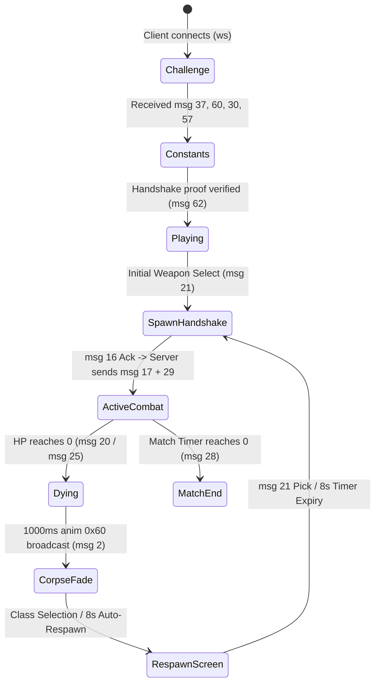

# Deadshot.io Server Architecture & Implementation Guide

This document describes the design, mechanics, state machines, and mathematical models powering the Deadshot.io standalone gameplay server (`gameplay/server/src/gameplay-server.mjs`).

---

## 1. Overview & Trust Model

The server uses a **Hybrid Authoritative** model tailored for high-speed web browser multiplayer:
1. **Movement:** Client-authoritative with position reporting. The client sends high-frequency input bits (`msg 1` at ~60Hz) and camera/eye world coordinates (`msg 52`). The server validates bounds and relays states to other players (`msg 2` at ~15-20Hz).
2. **Combat & Damage:** **100% Server-Authoritative.** The client sends shot aim angles and local raycast endpoints (`msg 8`). The server validates the 3D trajectory, checks for wall occlusion, computes closest approach to the target's 3D bounding cylinder, determines anatomical hit zones (Head vs. Body), applies weapon damage tables, tracks kills/assists, and manages respawns.

---

## 2. Server State Machine & Lifecycle



### 2.1 Connection & Handshake Phases
1. **`challenge` Phase:**
   - Client sends **`msg 37` (`N27s83WCNi`)** with a random seed challenge `val`.
   - Server computes expected challenge response:
     3972\text{expected} = (2 \times \text{challenge} + 0x178C4E) \pmod{0x1C9C380}3972
   - Server sends **`msg 61` (`Xar7p83ajar`)** with attestation constants (`m0: 2654435769, m1: 2135587861`).
2. **`constants` Phase:**
   - Client sends **`msg 60`** (token), **`msg 30`** (hello/handshake parameters), **`msg 57`** (player rank stats), and **`msg 62`** (proof buffer).
   - Server assigns team ID via **`msg 36` (`N3OM6i9r83`)** with XOR/Add decryption keys set to `0, 0` (no encryption overhead).
3. **`playing` Phase (World Spawn Batch):**
   - Server dispatches initial match parameters:
     - `msg 59` (`yEE39Vc650`): Stats reset.
     - `msg 3` (`v3j2TU68H`): Local player assigned entity ID.
     - `msg 33` (`a22SWM3PvBo`): Map index (e.g. `11 = newmlab`, `0 = tf`).
     - `msg 32` (`a0fN31N7p`): Game mode (`0 = FFA`, `1 = TDM`).
     - `msg 43` (`j00e7mAiju`) $\times N$: Player names and ranks.
     - `msg 44` (`F29o2i138`) $\times N$: Player loadout skin configurations.
     - `msg 24` (`RMFVb5UZGi7`) $\times N$: Initial scoreboard entries.
     - `msg 22` (`k1Qu903595`) $\times N$: Initial weapon assignments.
     - `msg 12` (`zSf6vw9ka`): RNG seed.
     - `msg 56` (`COCjGf0Sf`): Color configuration.
     - `msg 4` (`Ko38N6873G6`): Client interpolator clock sync.

---

## 3. Hit Registration & Anatomical Hitbox Model

### 3.1 3D Ray-to-Target Closest Approach Math
When a client shoots, it sends:
- `JoHdvmpcMvL`: Aim Pitch (radians)
- `uBHZYKAHa`: Body Yaw (radians, where shoot direction is $\text{yaw} + \pi$)
- `AHPhtLFTi, mGOwFesuTt, MHnEcbTxpbz`: Client raycast world impact point

The server computes the 3D unit ray vector $\hat{d} = (d_x, d_y, d_z)$:
3972d_x = \sin(\text{yaw} + \pi) \cdot \cos(\text{pitch})3972
3972d_y = \sin(\text{pitch})3972
3972d_z = \cos(\text{yaw} + \pi) \cdot \cos(\text{pitch})3972

For each candidate target at position $\vec{C} = (c_x, c_y, c_z)$ relative to shooter eye position $\vec{S} = (s_x, s_y, s_z)$:
3972\Delta x = c_x - s_x, \quad \Delta z = c_z - s_z3972
3972t = \frac{\Delta x \cdot d_x + \Delta z \cdot d_z}{d_x^2 + d_z^2}3972

The 3D point along the bullet ray at closest horizontal approach is:
3972\vec{P}_{\text{ray}} = \vec{S} + t \cdot \hat{d}3972

3972\text{hDist} = \sqrt{(P_{\text{ray}, x} - c_x)^2 + (P_{\text{ray}, z} - c_z)^2}3972
3972\text{relY} = P_{\text{ray}, y} - c_y \quad (\text{height relative to target eye level } c_y)3972

### 3.2 Anatomical Bounding Cylinder & Partitions
Derived from ground-truth character models (`character/tuxedonew.glb`):

```
Height (relY)        Anatomical Zone      Damage Multiplier     Hitmarker
──────────────────────────────────────────────────────────────────────────
+0.35m to -0.28m     Head / Face / Skull  3.5x (Headshot)       Red (+50 pts)
-0.28m to -0.80m     Neck / Chest         1.0x (Body Hit)       White
-0.80m to -1.30m     Stomach / Abdomen    1.0x (Body Hit)       White
-1.30m to -2.40m     Hips / Legs / Feet   1.0x (Body Hit)       White
```

* **Hit Criteria:** $\text{hDist} \le 0.75\text{m}$ and hBc2.40\text{m} \le \text{relY} \le +0.40\text{m}$.
* **Headshot Criteria:** $\text{isHit} \land \text{relY} \ge -0.28\text{m} \land \text{hDist} \le 0.55\text{m}$.
* **Occlusion Test (No-Wallbang):** If client ray hit an obstruction at distance $\text{pointLen} < t - 1.2\text{m}$, the hit is rejected.

---

## 4. Weapons & Damage Table

| Class Index | Weapon Key | Weapon Name | Base Body Damage | Headshot Damage (.5\times$) | Mag Capacity | Fire Rate / Notes |
|---|---|---|---|---|---|---|
| **0** | `smg` | Vector SMG | **11** | **39** | 40 | High ROF, close range |
| **1** | `ar` | AR-2 Assault Rifle | **21** | **74** | 30 | Medium ROF, balanced |
| **2** | `awp` | AWP Sniper | **100** | **350** (1-shot) | 3 | Slow ROF, high zoom scope |
| **3** | `shotgun` | Combat Shotgun | **20** / pellet | **70** / pellet | 2 | Spread pellets |

---

## 5. Animation & Input State Replication

### 5.1 Input Bitfield (`msg 1` `val`)
The client compresses inputs into a 9-bit bitset:
* Bit 0 (`0x01`): W (Forward)
* Bit 1 (`0x02`): S (Backward)
* Bit 2 (`0x04`): A (Strafe Left)
* Bit 3 (`0x08`): D (Strafe Right)
* Bit 4 (`0x10`): Space (Jump)
* Bit 5 (`0x20`): Shift (Slide / Sprint)
* Bit 6 (`0x40`): Right Click (ADS / Aim Down Sights)
* Bit 7 (`0x80`): R (Reload)
* Bit 8 (`0x100`): C (Crouch)

### 5.2 Animation State Byte (`msg 2` `YSmEAVINAh`)
The server translates live inputs into Three.js animation blending flags:
* `0x01`: Moving Left
* `0x02`: Moving Right
* `0x04`: Moving Forward (Up)
* `0x08`: Moving Backward (Down)
* `0x10`: ADS Aim Stance
* `0x20`: Grounded / Idle (`vQ5Ra371n0`)
* `0x40`: Death Collapse / Corpse Fade (`PxxmChYjxoE`)
* `0x100`: Crouch Stance (`W91ldgW19d` $\rightarrow$ `crouchIdle` / `crouchWalk`)

---

## 6. Death, Respawn, and Model Synchronization

1. **Kill Event (`onKill`):**
   - Server decrements `victim.hp = 0` and sets `victim.alive = false, victim.deadAt = Date.now()`.
   - Sends **`msg 20` (`gB4Cncy3f4`)** to victim: `{ id: killer.id, h: killer.hp }`.
   - Broadcasts killfeed **`msg 25` (`Y6805DB31Br`)** and scoreboard **`msg 24` (`RMFVb5UZGi7`)**.
   - Server starts **8-second fallback respawn timer** (`scheduleRespawn()`).
2. **Corpse Fade (`tick` Loop):**
   - For 000\text{ms}$ after kill, server broadcasts `msg 2` with `anim = 0x60` (`0x40 death + 0x20 idle`) and `hp = 0`.
   - Opponents' clients render death collapse and fade out the corpse mesh.
3. **Class Selection & Respawn Handshake:**
   - Player clicks a class button $\rightarrow$ Client sends **`msg 21` (`B20L372s8`)**.
   - Server cancels 8s timer, calls `alloc.respawn(p)`, sets `spawnPending = true`, updates `p.weaponType`, and sends `msg 22 + msg 18`.
   - Client acknowledges with **`msg 16`**.
   - Server runs `onStateAck()`: sets `p.spawned = true`, sends `msg 17` (yaw) + `msg 29` (spawn trigger), and broadcasts `msg 22` (weapon/model swap) + `msg 24` (scoreboard) to all opponents.
   - Opponents' clients call `XU()` to immediately attach the new 3D model (`tuxedonew.glb`, `shotgunplayerout.gltf`, `femaleriggedout.gltf`, `rigged_untexturedout.gltf`).
